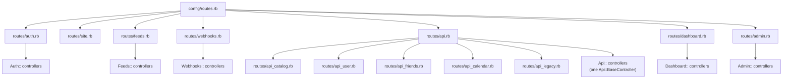

# Code organization

This page gives the rules for where code goes. Issue #710 set them. Follow them for new code.

## Rules

1. **Group by domain.** A domain's services, jobs, value objects, and errors share one module in every folder. For example, `FriendMeetings::Creator` is in `app/services/friend_meetings/creator.rb`, and `FriendMeetings::PublishJob` is in `app/jobs/friend_meetings/publish_job.rb`.
2. **Keep models, policies, and mailers flat.** The database stores model class names (polymorphic types, Solid Queue job arguments), and Pundit finds a policy from the model name. `Course::MeetingTime` and `TwentyFiveLive::*` are the only nested models.
3. **Use the plural for a domain namespace:** `Courses::`, `Faculties::`, `Friendships::`. A singular name such as `Faculty::` makes the `Faculty` model a namespace.
4. **Do not use a namespace that a gem owns.** The Google gems define `Google::Auth` and `Google::Apis`, so the app uses `GoogleSignIn::` and `GoogleCalendar::`. Flipper owns `Flipper::`, so the app uses `FeatureFlags::`. PgHero owns `PgHero::`, so its jobs are in `Database::`.
5. **Name a class after what it does.** Inside a namespace, a service has no `Service` suffix: `Courses::Processor`, not `CourseProcessorService`. A class that only sends HTTP requests to an outside system is a `Client`.
6. **Keep an error in the namespace that raises it:** `Courses::InvalidTermError`, `Catalog::FilterError`.
7. **Define a namespaced class inside its modules:** `module Admin` and then `class UsersController`, not `class Admin::UsersController`. RuboCop checks this with `Style/ClassAndModuleChildren`.

## Domains

| Namespace | What it holds |
|---|---|
| `Catalog` | The course catalog: import, snapshot, LeopardWeb client, queries, serializers, semantic search |
| `Courses` | A user's course list: enrollments, processed events |
| `CourseCalendars` | Calendar sync for every provider: sync jobs, provider selection, sync markers, the ICS feed |
| `GoogleCalendar` | Google Calendar: the provider, event labels, colors, rate limits, calendar jobs |
| `MicrosoftGraph` | Microsoft Graph: the HTTP client, the calendar provider, calendar jobs |
| `GoogleSignIn` | Google sign-in and account linking: token checks, code exchange, OAuth state |
| `MicrosoftSignIn` | Sign-in with a WIT Microsoft account |
| `OauthCredentials` | Token refresh and revoke for every provider |
| `Risc` | Google RISC security events |
| `FriendMeetings`, `Friendships`, `MeetingLinks` | Friends features |
| `Faculties` | The faculty directory and RateMyProfessor |
| `FinalsSchedules` | Finals schedule PDFs and their parsers |
| `UniversityCalendar` | The university event calendar import |
| `Embeddings` | Vector embeddings |
| `Preferences` | Calendar preferences: resolution, versions, templates |
| `FeatureFlags` | Flipper flags, groups, and actors |
| `TwentyFiveLive` | 25Live: client, sync job, models, and value objects |
| `Cleanup`, `Database` | Maintenance jobs |

Code with no domain stays at the root of its folder, for example `ApplicationService`, `JsonWebTokenService`, and `AppMetrics`.

## Controllers and routes

- **API route files:** `routes/api.rb` draws each `api_*.rb` file inside `namespace :api`. Put a new API route in the file for its area. The catch-all route stays last in `routes/api.rb`.
- **API:** every API controller inherits from `Api::BaseController`. `CLAUDE.md` has the rules for auth, errors, and old paths.
- **Fixed URLs:** the OAuth callbacks, `/risc/events`, and `/calendar/:token` never change. Google, Microsoft, and calendar apps store them.

## Renaming a job

Solid Queue stores job class names in the database. `CLAUDE.md` ("Jobs") gives the steps: a fixed `CONCURRENCY_GROUP`, an alias file at the old path, and `bin/rails jobs:unknown_class_names` before the alias goes.
