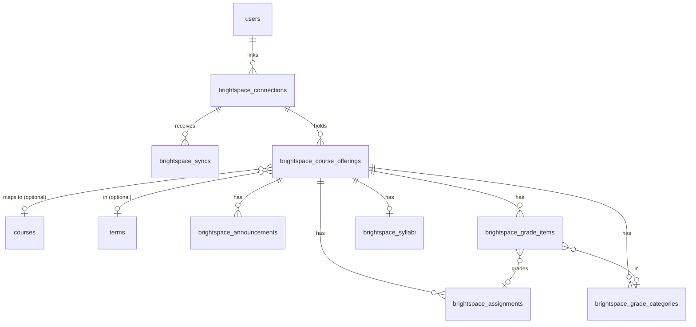
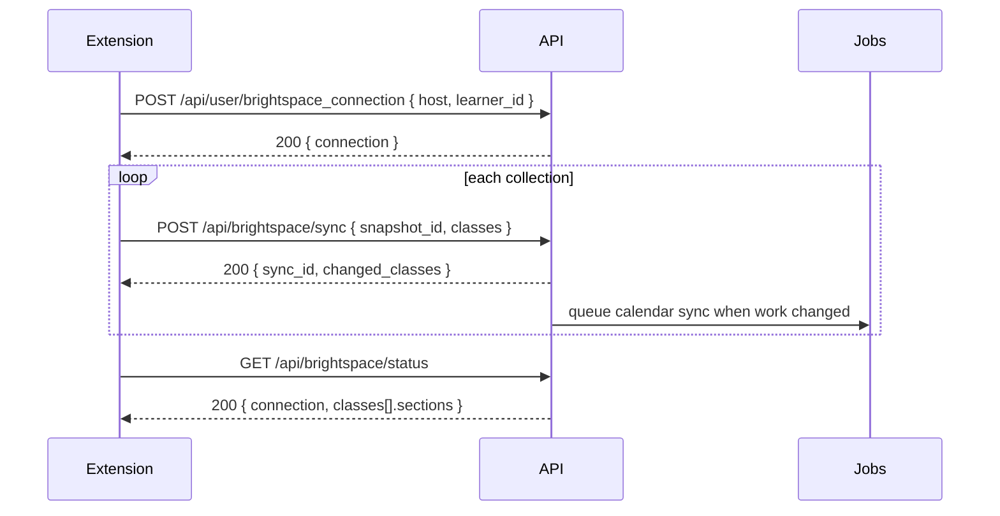
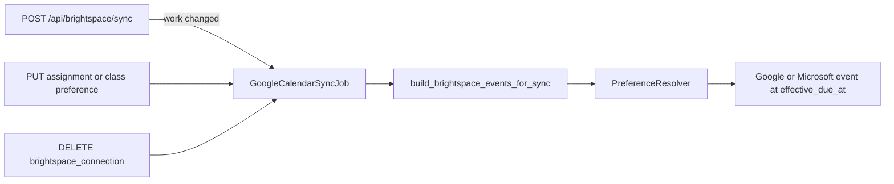

# Brightspace import and class pages

The extension collects a student's Brightspace (D2L) data in the browser and sends it to the backend. The backend stores classes, assignments, announcements, grades, and syllabus sources. The frontend keeps a cached copy and does every grade calculation.

The backend keeps the imported Brightspace data apart from the data that the user owns: personal progress, deadline overrides, confirmed syllabus rules, grade settings, and hypothetical grade scenarios. A sync never changes user-owned data.

## Feature flag

The flag `brightspace` (`brightspace` in `/api/user/feature_flags`) is off by default. While the flag is off for the signed-in user, every route on this page answers 404.

## Data model

Every imported row belongs to one connection, and a connection belongs to one user. Two users who take the same class have separate rows. One user can never change the data of another user.



The API calls a `Brightspace::CourseOffering` a "class". `Class` cannot be a Ruby constant name, and `Course` is the registration course.

IDs in routes and in `id` fields are backend public IDs, such as `bcl_...` for a class and `bas_...` for an assignment. Brightspace IDs stay in `source_id`.

## Conventions

- All routes need the usual API token (`Authorization: Bearer <token>`). The user comes from the token, never from the body.
- Times are UTC ISO 8601 strings. An unknown time or score is `null`.
- `version` is an opaque token. Compare it with the cached one. Do not parse it. It changes when the imported data of a class changes. A sync that changes nothing leaves it as it is.

### Errors

| Status | Body | When |
| --- | --- | --- |
| 400 | `{ success: false, error, code: "VALIDATION_FAILED" }` | A required parameter is missing. |
| 401 | `{ success: false, error, code }` | The app token is missing, invalid, or revoked. A Brightspace session that expired never gives a 401. |
| 403 | `{ error }` | A policy denies the action. |
| 404 | `{ error }` | The record is not in the user's data, or the flag is off. |
| 409 | `{ error, code }` | A conflict. The codes are below. |
| 422 | `{ error }` | A field has a bad value. The message names the field, for example `classes[0].assignments[1].due_at must be an ISO 8601 time`. |

The 409 codes:

- `NOT_CONNECTED`: a sync arrived, but no Brightspace account is linked.
- `CONNECTION_MISMATCH`: the `host` and `learner_id` of a sync are not those of the linked account.
- `SNAPSHOT_CONFLICT`: a `snapshot_id` came back with different data.
- `SYLLABUS_REVISION_MISMATCH`: a syllabus confirmation names a revision that is not the stored one.

## Connection

### GET /api/user/brightspace_connection

Returns the active connection, or `null`.

```json
{
  "connection": {
    "id": "bsc_...",
    "host": "brightspace.example.edu",
    "learner_id": "98765",
    "status": "active",
    "reconnect_required": false,
    "connected_at": "2026-10-06T16:55:00Z",
    "disconnected_at": null,
    "last_synced_at": "2026-10-06T17:00:02Z",
    "reconnect_required_at": null
  }
}
```

### POST /api/user/brightspace_connection

Body: `{ "host": "brightspace.example.edu", "learner_id": "98765" }`. Returns `{ connection }`.

- The host is stored in lower case, without a scheme or a trailing slash.
- Linking the same host and learner again reuses the old connection and its data.
- Linking a different account disconnects the old one. Its data stays, but the read routes show the data of the new account. The new account starts with no data.
- Linking clears `reconnect_required`.

### DELETE /api/user/brightspace_connection

Answers 204. Imports and calendar sync stop for the account. The stored data stays. Answers 404 when no account is linked.

## Sync

### POST /api/brightspace/sync

```json
{
  "snapshot_id": "8b451fe1-5c9c-44c6-86c6-846ac9a0a250",
  "host": "brightspace.example.edu",
  "learner_id": "98765",
  "collected_at": "2026-10-06T17:00:00Z",
  "reconnect_required": false,
  "classes": [{
    "source_id": "12414",
    "course_id": "crs_...",
    "term_id": "trm_...",
    "title": "Data Structures",
    "complete_sections": ["assignments"],
    "section_errors": { "grades": "Gradebook request timed out" },
    "assignments": [{
      "source_id": "56789",
      "kind": "assignment",
      "title": "Lab 4: Linked lists",
      "description": null,
      "due_at": "2026-10-09T03:59:00Z",
      "opens_at": null,
      "closes_at": null,
      "user_due_at": null,
      "source_url": "https://brightspace.example.edu/d2l/...",
      "submission_status": "not_submitted",
      "submitted_at": null,
      "feedback": null
    }],
    "announcements": [{ "source_id": "301", "title": "...", "body": "...", "source_url": null, "posted_at": "..." }],
    "grades": {
      "reported_total": { "points_earned": 41.5, "points_possible": 50, "percent": 83.0, "letter": "B" },
      "categories": [{
        "source_id": "900", "name": "Labs", "weight": 40,
        "drop_lowest": 1, "drop_highest": null, "extra_credit": false
      }],
      "items": [{
        "source_id": "7002", "name": "Lab 4", "category_source_id": "900",
        "assignment_source_id": "56789", "assignment_kind": "assignment",
        "points_earned": null, "points_possible": 10, "weight": null,
        "grading_status": "ungraded", "extra_credit": null, "feedback": null, "graded_at": null
      }]
    },
    "syllabus": {
      "source_id": "content-55",
      "url": "https://brightspace.example.edu/d2l/le/content/12414/viewContent/55/View",
      "title": "Course Syllabus",
      "revision": "2026-09-01T00:00:00Z",
      "extracted": { "categories": [{ "name": "Labs", "weight": 40, "source_ref": "page 2" }] }
    }
  }]
}
```

Field values:

- `kind`: `assignment`, `quiz`, or `discussion`.
- `submission_status`: `not_submitted`, `submitted`, `graded`, `exempt`, or `null`.
- `grading_status`: `graded`, `ungraded`, or `excused`. A `graded` item with `points_earned: 0` is a zero. An `ungraded` item has `points_earned: null`.
- `due_at`, `opens_at`, and `closes_at` are the class dates. `user_due_at` is an individual deadline (special access). Send each one as Brightspace shows it. Do not copy one date into another.
- `assignment_kind` defaults to `assignment`.
- `extracted` is an object of at most 200 KB, in any shape. The backend stores it as it is.
- `reconnect_required: true` records that the Brightspace session expired, so the frontend can ask the user to sign in to Brightspace again. The app login stays valid.

Limits: 100 classes for each sync, and 2,000 entries in each list.

Rules:

- Each class can send `assignments`, `announcements`, `grades`, and `syllabus`. A section that the class leaves out stays as it is.
- A section in `complete_sections` must hold the full result, with all pages. Only a complete section marks rows that it does not list as removed, and only rows of that class. A removed row stays in the database with `removed_at`, and comes back when a later sync lists it.
- A section in `section_errors` keeps its stored data. The error shows in the status route.
- Rows match on the class `source_id`, and on `kind` and `source_id` for assignments. The host and the learner come from the connection.
- The same `snapshot_id` with the same data answers with the first response and changes nothing. Key order does not matter.
- When a section already holds data from a later `collected_at`, the backend skips that section of an older snapshot.
- `course_id` links the class to a registration course. The course must be one of the user's enrollments. Else the backend ignores it and adds a warning. `course_id` sets the term. Without a course, `term_id` sets it. A class can be stored with no course and no term.
- The whole sync is one transaction. If a row is invalid, nothing from the snapshot is stored.

Response:

```json
{
  "sync_id": "bss_...",
  "status": "complete",
  "changed_classes": [{ "id": "bcl_...", "version": "..." }],
  "warnings": [{ "class_source_id": "12414", "message": "course_id is not one of your enrolled courses" }]
}
```

`status: "complete"` means that the import finished. Calendar changes run later in a job.

### GET /api/brightspace/status

Shows the current connection (the active one, or the last one when none is active) and the state of each section of each class.

```json
{
  "connection": { "id": "bsc_...", "status": "active", "reconnect_required": false, "...": "..." },
  "classes": [{
    "id": "bcl_...",
    "source_id": "12414",
    "title": "Data Structures",
    "version": "...",
    "sections": {
      "assignments": { "last_collected_at": "2026-10-06T17:00:00Z", "complete": true, "error": null, "failed_at": null },
      "grades": { "last_collected_at": null, "complete": false, "error": "Gradebook request timed out", "failed_at": "2026-10-06T17:00:00Z" }
    }
  }]
}
```



## Classes and assignments

The read routes show the data of the current connection: the active one, or the last one when none is active. A record of another user, or of an older connection, answers 404. Raw database ids answer 404.

The list routes take `page` and `per_page` (default 25, at most 100), and return `meta` in the same shape as `/api/university_calendar_events`:

```json
{ "current_page": 1, "total_pages": 1, "total_count": 3, "per_page": 25 }
```

`term_id` is the backend term public id (`trm_...`), not the `term_uid` of the schedule routes. An unknown term gives an empty list. `term` objects come from `TermSerializer`.

### Effective deadline

`effective_due_at` is the first of these that is set:

1. The user's `due_at_override`.
2. The individual Brightspace deadline, `user_due_at`.
3. The class deadline, `due_at`.

Lists order by `effective_due_at`, then by id. Work with no deadline comes last. Removed work is not listed.

### GET /api/classes

Query: `term_id`, `page`, `per_page`.

```json
{
  "classes": [{
    "id": "bcl_...",
    "source_id": "12414",
    "course_id": "crs_...",
    "term": { "name": "Fall 2026", "id": 202610, "pub_id": "trm_...", "start_date": "...", "end_date": "..." },
    "title": "Data Structures",
    "next_deadline": { "assignment_id": "bas_...", "kind": "assignment", "title": "Lab 4", "effective_due_at": "..." },
    "version": "...",
    "sync": { "last_synced_at": "...", "last_collected_at": "...", "has_errors": false }
  }],
  "meta": { "current_page": 1, "total_pages": 1, "total_count": 1, "per_page": 25 }
}
```

`course_id` and `term` are `null` for a class that is not mapped. `next_deadline` is the first work that is not removed, not marked `done`, and not past.

### GET /api/classes/:id

```json
{
  "class": { "...": "the class list item" },
  "upcoming_assignments": [{ "...": "an assignment list item" }],
  "announcements": [{ "id": "ban_...", "source_id": "301", "title": "...", "body": "...", "source_url": null, "posted_at": "..." }],
  "preferences": { "calendar": { "...": "..." }, "grades": { "...": "..." } },
  "sync": { "assignments": { "last_collected_at": "...", "complete": true, "error": null, "failed_at": null } }
}
```

`upcoming_assignments` holds at most 10 entries: not past, not `done`. `announcements` holds the 20 latest.

### GET /api/classes/:id/assignments and GET /api/assignments

Query: `status`, `due_before`, `page`, `per_page`. `/api/assignments` also takes `term_id`.

- `status` filters on the personal progress: `not_started`, `in_progress`, or `done`. Work with no preference is `not_started`. Another value answers 400.
- `due_before` is an ISO 8601 time. It is an exclusive cutoff on `effective_due_at`. A bad time answers 400.

```json
{
  "assignments": [{
    "id": "bas_...",
    "class_id": "bcl_...",
    "source_id": "56789",
    "kind": "assignment",
    "title": "Lab 4: Linked lists",
    "source_url": "https://brightspace.example.edu/d2l/...",
    "due_at": "2026-10-09T03:59:00Z",
    "opens_at": null,
    "closes_at": null,
    "user_due_at": null,
    "effective_due_at": "2026-10-09T03:59:00Z",
    "submission_status": "not_submitted",
    "submitted_at": null,
    "removed_at": null,
    "preference": { "progress": "not_started", "due_at_override": null }
  }],
  "meta": { "...": "..." }
}
```

### GET /api/assignments/:id

Returns `{ assignment }`: the list item plus `description` and `feedback`. A removed assignment still answers, with `removed_at` set.

## Preferences

Updates take `PUT` or `PATCH`. Both change only the fields in the body. Each response has the `version` of the class, which a saved preference also changes.

### GET and PUT /api/assignments/:id/preference

```json
{ "assignment_preference": { "progress": "in_progress", "due_at_override": "2026-10-08T22:00:00Z" } }
```

- `progress`: `not_started`, `in_progress`, or `done`. `done` never changes the Brightspace `submission_status`.
- `due_at_override`: an ISO 8601 time, or `null` to clear it. A bad time answers 422.

Response: `{ assignment_preference, version }`. Without a saved preference, GET returns `not_started` and `null`.

### GET and PUT /api/classes/:id/preference

```json
{
  "class_preference": {
    "calendar": {
      "sync_enabled": true,
      "included_kinds": ["assignment", "quiz"],
      "title_template": "{{title}}",
      "description_template": null,
      "location_template": null,
      "color_id": "#d50000",
      "visibility": "default",
      "reminder_settings": [{ "time": "1", "type": "days", "method": "notification" }]
    },
    "grades": {
      "mode": "custom",
      "categories": [{
        "category_id": "bgc_...", "name": "Labs", "weight": 40,
        "drop_lowest": 1, "drop_highest": null, "extra_credit": false,
        "item_ids": ["bgi_..."]
      }]
    }
  }
}
```

Calendar fields:

- `sync_enabled` defaults to `true`. `included_kinds` defaults to every kind. Send `null` to go back to the default.
- The template, color, and visibility fields work as in `calendar_preference`. A `null` field inherits.
- `reminder_settings` uses the reminder entries `{ time, type, method }`. `type` is `minutes`, `hours`, or `days`. `notification` and `popup` mean the same. A field left out stays. `"default"` inherits. `[]` turns reminders off.

Grade fields:

- `mode`: `brightspace` (the default), `syllabus`, or `custom`.
- `categories` is the grading-rule format. Each entry names an imported category with `category_id`, or a new one with `name`. `item_ids` maps grade items into the category. Every id must belong to the class. The allowed keys are `category_id`, `name`, `weight`, `drop_lowest`, `drop_highest`, `extra_credit`, and `item_ids`.

Response: `{ class_preference, version }`. GET without a saved preference returns the defaults.

## Grades

### GET /api/classes/:id/grades

```json
{
  "reported_total": { "points_earned": 41.5, "points_possible": 50.0, "percent": 83.0, "letter": "B" },
  "categories": [{
    "id": "bgc_...", "source_id": "900", "name": "Labs", "weight": 40.0,
    "drop_lowest": 1, "drop_highest": null, "extra_credit": false
  }],
  "items": [{
    "id": "bgi_...", "source_id": "7002", "category_id": "bgc_...", "assignment_id": "bas_...",
    "name": "Lab 4", "points_earned": null, "points_possible": 10.0, "weight": null,
    "grading_status": "ungraded", "extra_credit": null, "feedback": null, "graded_at": null
  }],
  "preferences": { "mode": "brightspace", "categories": [] },
  "scenarios": [],
  "version": "..."
}
```

- These are the grades as Brightspace reports them. The backend does no grade calculation, and no user setting changes these values.
- A `graded` item with `points_earned: 0` is a zero. An `ungraded` item has `points_earned: null`. A `null` weight or rule is unknown.
- `preferences` is the `grades` part of the class preference.
- Removed categories and items are not listed.

### Grade scenarios

A scenario stores inputs: hypothetical points for grade items, and optional category rules in the grading-rule format. It never replaces the imported grades. A class can have at most 50 scenarios.

| Route | Answer |
| --- | --- |
| `GET /api/classes/:id/grade_scenarios` | 200 `{ scenarios }` |
| `POST /api/classes/:id/grade_scenarios` | 201 `{ scenario, version }` |
| `PUT /api/classes/:id/grade_scenarios/:scenario_id` | 200 `{ scenario, version }` |
| `DELETE /api/classes/:id/grade_scenarios/:scenario_id` | 204 |

```json
{
  "grade_scenario": {
    "name": "Ace the final",
    "scores": [{ "item_id": "bgi_...", "points": 9.5 }],
    "category_overrides": [{ "category_id": "bgc_...", "weight": 50 }]
  }
}
```

A scenario:

```json
{ "id": "bgs_...", "class_id": "bcl_...", "name": "...", "scores": [], "category_overrides": null, "updated_at": "..." }
```

`scores` can hold at most 500 entries, one for each grade item of the class. `points` is a number of 0 or more, or `null`. An update changes only the fields in the body.

## Syllabus

### GET /api/classes/:id/syllabus

```json
{
  "source": {
    "source_id": "content-55",
    "url": "https://brightspace.example.edu/d2l/le/content/12414/viewContent/55/View",
    "title": "Course Syllabus",
    "revision": "2026-09-01T00:00:00Z",
    "removed_at": null
  },
  "extracted": { "categories": [{ "name": "Labs", "weight": 40, "source_ref": "page 2" }] },
  "confirmed": {
    "source_revision": "2026-09-01T00:00:00Z",
    "confirmed": { "categories": [{ "name": "Labs", "weight": 45, "source_ref": "page 2" }] },
    "confirmed_at": "..."
  },
  "version": "..."
}
```

`source` and `extracted` are `null` when no syllabus was imported. `confirmed` is `null` until the user confirms the rules. The confirmed rules are private to the user and stay through later imports. When `confirmed.source_revision` is not `source.revision`, the source changed after the user confirmed it.

### PUT /api/classes/:id/syllabus/preference

```json
{ "syllabus_preference": { "source_revision": "2026-09-01T00:00:00Z", "confirmed": { "...": "..." } } }
```

- `source_revision` must be the revision of the stored syllabus. Else the answer is 409 with `code: "SYLLABUS_REVISION_MISMATCH"`, so the user can review the new source first.
- `confirmed` is an object of at most 200 KB, in any shape. Keep the source references in it.
- Confirming does not change the grade settings and does not create calendar events.

Response: `{ syllabus_preference, version }`.

## Calendar sync

Deadlines go to the user's calendar through the normal calendar sync (`GoogleCalendarSyncJob`, for Google and Microsoft). Only the active connection syncs, and only while the flag is on for the user.

- Each assignment with an effective deadline gets one event, keyed on the assignment (`calendar_events.brightspace_assignment_id`). A changed deadline moves that event. It never adds a second one.
- The event starts and ends at `effective_due_at`, so it has no length and never blocks free time. `opens_at` and `closes_at` never become the event time.
- Removed work, work with no deadline, and a disconnected account lose their future events on the next sync. Past events stay, as for other event types.
- A class preference with `sync_enabled: false` removes the events of the class. `included_kinds` limits the kinds.
- A sync that changes work, a saved assignment or class preference, and a link or disconnect queue a calendar sync. A class preference queues a forced sync, because templates can change every event of the class.
- Friends never see deadlines: busy blocks and `processed_events` read only registration courses.

### Preferences

Deadline events use the same preference system as course events, with one more level. The resolver takes the first value that is set:

1. The individual event preference.
2. The class preference (`brightspace_class`).
3. The calendar preference for the event type `brightspace_assignment` (`PUT /api/calendar_preferences/brightspace_assignment`).
4. The deadline defaults: title `{{title}}`, description `{{class_title}}` and `{{source_url}}`, color banana, and a reminder 1 day before.

The global course preference does not apply, because its templates name course fields that a deadline does not have.

When Brightspace reports the work as `submitted`, `graded`, or `exempt`, or the user marks it `done`, the event keeps no reminders. The source is `finished`.

Templates for deadlines can use `title`, `class_title`, `assignment_kind`, `source_url`, `due_date`, `start_time`, `day`, `term`, and the course fields of a mapped course (`course_code`, `subject`, `course_number`, `section_number`, `crn`).

### Deadline changes

When a sync moves `due_at`, `user_due_at`, `opens_at`, or `closes_at` of existing work, the backend records a `Brightspace::DeadlineChange`. `notified_at` stays `null` until a notification goes out (`DeadlineChange.pending_notification`). `GET /api/assignments/:id` lists the 20 latest changes:

```json
"deadline_changes": [
  { "field": "due_at", "previous_at": "2026-10-09T03:59:00Z", "current_at": "2026-10-10T03:59:00Z", "detected_at": "..." }
]
```


