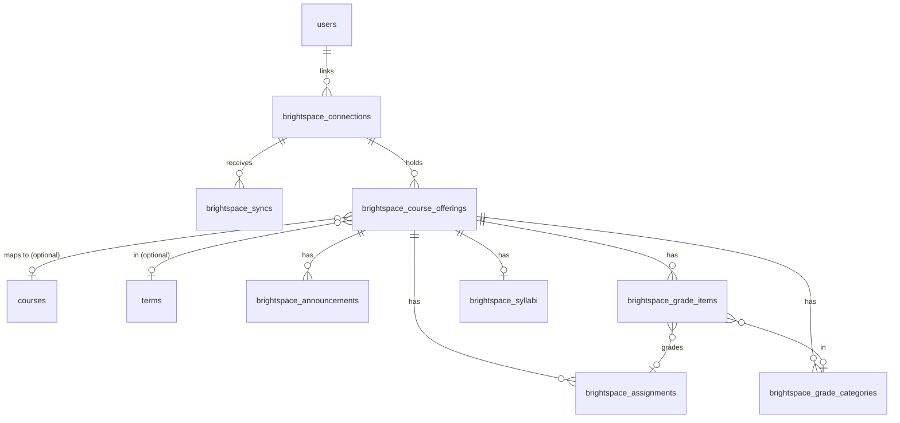
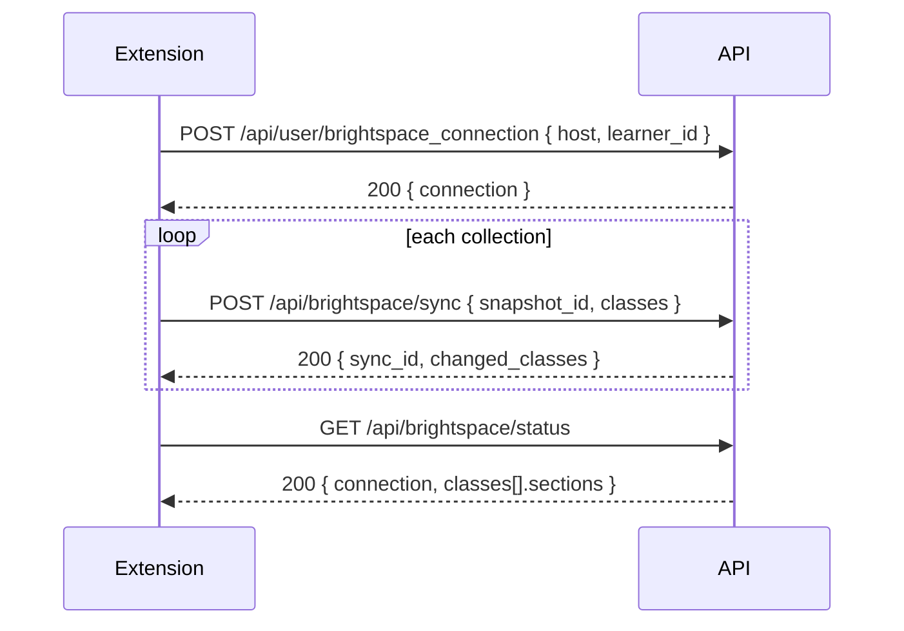

# Brightspace import and class pages

The extension collects a student's Brightspace (D2L) data in the browser and sends it to the backend. The backend stores classes, assignments, announcements, grades, and syllabus sources. The frontend keeps a cached copy and does every grade calculation.

The backend keeps the imported Brightspace data apart from the data that the user owns: personal progress, deadline overrides, confirmed syllabus rules, grade settings, and hypothetical grade scenarios. A sync never changes user-owned data.

## Feature flag

The flag `brightspace` (`brightspace` in `/api/user/feature_flags`) is off by default. While the flag is off for the signed-in user, every route on this page answers 404.

## Data model

Every imported row belongs to one connection, and a connection belongs to one user. Two users who take the same class have separate rows. One user can never change the data of another user.



The API calls a `Brightspace::CourseOffering` a "class". `Class` cannot be a Ruby constant name, and `Course` is the registration course.

IDs in routes and in `id` fields are backend public IDs, such as `bcl_...` for a class and `bas_...` for an assignment. Brightspace IDs stay in `source_id`.

## Conventions

- All routes need the usual API token (`Authorization: Bearer <token>`). The user comes from the token, never from the body.
- Times are UTC ISO 8601 strings. An unknown time or score is `null`.
- `version` is an opaque token. Compare it with the cached one. Do not parse it. It changes when the imported data of a class changes. A sync that changes nothing leaves it as it is.

### Errors

| Status | Body | When |
| --- | --- | --- |
| 400 | `{ success: false, error, code: "VALIDATION_FAILED" }` | A required parameter is missing. |
| 401 | `{ success: false, error, code }` | The app token is missing, invalid, or revoked. A Brightspace session that expired never gives a 401. |
| 403 | `{ error }` | A policy denies the action. |
| 404 | `{ error }` | The record is not in the user's data, or the flag is off. |
| 409 | `{ error, code }` | A conflict. The codes are below. |
| 422 | `{ error }` | A field has a bad value. The message names the field, for example `classes[0].assignments[1].due_at must be an ISO 8601 time`. |

The 409 codes:

- `NOT_CONNECTED`: a sync arrived, but no Brightspace account is linked.
- `CONNECTION_MISMATCH`: the `host` and `learner_id` of a sync are not those of the linked account.
- `SNAPSHOT_CONFLICT`: a `snapshot_id` came back with different data.

## Connection

### GET /api/user/brightspace_connection

Returns the active connection, or `null`.

```json
{
  "connection": {
    "id": "bsc_...",
    "host": "brightspace.example.edu",
    "learner_id": "98765",
    "status": "active",
    "reconnect_required": false,
    "connected_at": "2026-10-06T16:55:00Z",
    "disconnected_at": null,
    "last_synced_at": "2026-10-06T17:00:02Z",
    "reconnect_required_at": null
  }
}
```

### POST /api/user/brightspace_connection

Body: `{ "host": "brightspace.example.edu", "learner_id": "98765" }`. Returns `{ connection }`.

- The host is stored in lower case, without a scheme or a trailing slash.
- Linking the same host and learner again reuses the old connection and its data.
- Linking a different account disconnects the old one. Its data stays, but the read routes show the data of the new account. The new account starts with no data.
- Linking clears `reconnect_required`.

### DELETE /api/user/brightspace_connection

Answers 204. Imports and calendar sync stop for the account. The stored data stays. Answers 404 when no account is linked.

## Sync

### POST /api/brightspace/sync

```json
{
  "snapshot_id": "8b451fe1-5c9c-44c6-86c6-846ac9a0a250",
  "host": "brightspace.example.edu",
  "learner_id": "98765",
  "collected_at": "2026-10-06T17:00:00Z",
  "reconnect_required": false,
  "classes": [{
    "source_id": "12414",
    "course_id": "crs_...",
    "term_id": "trm_...",
    "title": "Data Structures",
    "complete_sections": ["assignments"],
    "section_errors": { "grades": "Gradebook request timed out" },
    "assignments": [{
      "source_id": "56789",
      "kind": "assignment",
      "title": "Lab 4: Linked lists",
      "description": null,
      "due_at": "2026-10-09T03:59:00Z",
      "opens_at": null,
      "closes_at": null,
      "user_due_at": null,
      "source_url": "https://brightspace.example.edu/d2l/...",
      "submission_status": "not_submitted",
      "submitted_at": null,
      "feedback": null
    }],
    "announcements": [{ "source_id": "301", "title": "...", "body": "...", "source_url": null, "posted_at": "..." }],
    "grades": {
      "reported_total": { "points_earned": 41.5, "points_possible": 50, "percent": 83.0, "letter": "B" },
      "categories": [{
        "source_id": "900", "name": "Labs", "weight": 40,
        "drop_lowest": 1, "drop_highest": null, "extra_credit": false
      }],
      "items": [{
        "source_id": "7002", "name": "Lab 4", "category_source_id": "900",
        "assignment_source_id": "56789", "assignment_kind": "assignment",
        "points_earned": null, "points_possible": 10, "weight": null,
        "grading_status": "ungraded", "extra_credit": null, "feedback": null, "graded_at": null
      }]
    },
    "syllabus": {
      "source_id": "content-55",
      "url": "https://brightspace.example.edu/d2l/le/content/12414/viewContent/55/View",
      "title": "Course Syllabus",
      "revision": "2026-09-01T00:00:00Z",
      "extracted": { "categories": [{ "name": "Labs", "weight": 40, "source_ref": "page 2" }] }
    }
  }]
}
```

Field values:

- `kind`: `assignment`, `quiz`, or `discussion`.
- `submission_status`: `not_submitted`, `submitted`, `graded`, `exempt`, or `null`.
- `grading_status`: `graded`, `ungraded`, or `excused`. A `graded` item with `points_earned: 0` is a zero. An `ungraded` item has `points_earned: null`.
- `due_at`, `opens_at`, and `closes_at` are the class dates. `user_due_at` is an individual deadline (special access). Send each one as Brightspace shows it. Do not copy one date into another.
- `assignment_kind` defaults to `assignment`.
- `extracted` is an object of at most 200 KB, in any shape. The backend stores it as it is.
- `reconnect_required: true` records that the Brightspace session expired, so the frontend can ask the user to sign in to Brightspace again. The app login stays valid.

Limits: 100 classes for each sync, and 2,000 entries in each list.

Rules:

- Each class can send `assignments`, `announcements`, `grades`, and `syllabus`. A section that the class leaves out stays as it is.
- A section in `complete_sections` must hold the full result, with all pages. Only a complete section marks rows that it does not list as removed, and only rows of that class. A removed row stays in the database with `removed_at`, and comes back when a later sync lists it.
- A section in `section_errors` keeps its stored data. The error shows in the status route.
- Rows match on the class `source_id`, and on `kind` and `source_id` for assignments. The host and the learner come from the connection.
- The same `snapshot_id` with the same data answers with the first response and changes nothing. Key order does not matter.
- When a section already holds data from a later `collected_at`, the backend skips that section of an older snapshot.
- `course_id` links the class to a registration course. The course must be one of the user's enrollments. Else the backend ignores it and adds a warning. `course_id` sets the term. Without a course, `term_id` sets it. A class can be stored with no course and no term.
- The whole sync is one transaction. If a row is invalid, nothing from the snapshot is stored.

Response:

```json
{
  "sync_id": "bss_...",
  "status": "complete",
  "changed_classes": [{ "id": "bcl_...", "version": "..." }],
  "warnings": [{ "class_source_id": "12414", "message": "course_id is not one of your enrolled courses" }]
}
```

`status: "complete"` means that the import finished. Calendar changes run later in a job.

### GET /api/brightspace/status

Shows the current connection (the active one, or the last one when none is active) and the state of each section of each class.

```json
{
  "connection": { "id": "bsc_...", "status": "active", "reconnect_required": false, "...": "..." },
  "classes": [{
    "id": "bcl_...",
    "source_id": "12414",
    "title": "Data Structures",
    "version": "...",
    "sections": {
      "assignments": { "last_collected_at": "2026-10-06T17:00:00Z", "complete": true, "error": null, "failed_at": null },
      "grades": { "last_collected_at": null, "complete": false, "error": "Gradebook request timed out", "failed_at": "2026-10-06T17:00:00Z" }
    }
  }]
}
```


