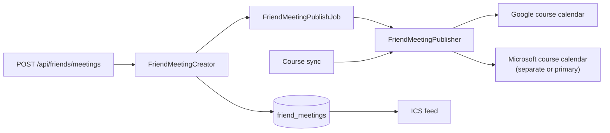

# Friend meetings

The extension suggests times when a person and some friends are free. The person picks one time, and the app makes a calendar event from it. This is part of friends v6.

A one-time meeting link uses the same path for a person who is not a friend. See [meeting-links.md](meeting-links.md).

## The flag

The Flipper flag `friend_meeting_events` is off by default. Friends v6 waits on a privacy policy update, so do not turn on the flag for real users until that update is live. While the flag is off, the route answers 404.

Turn on the flag for one test account first in the Flipper UI (`/admin/flipper`). Enter the account's email or `usr_` id: the app saves the gate as `User;<id>`. The extension can read the flag as `friendMeetingEvents` from `GET /api/user/feature_flags`.

## Make a meeting

`POST /api/friends/meetings`, with the extension's bearer token.

```json
{
  "title": "Study group",
  "start_time": "2026-10-14T15:00:00-04:00",
  "end_time": "2026-10-14T16:00:00-04:00",
  "location": "Library",
  "friend_ids": ["usr_abc123"],
  "frequency": "weekly",
  "invite_friends": true
}
```

| Field | Required | Notes |
| --- | --- | --- |
| `title` | yes | 200 characters at most. |
| `start_time`, `end_time` | yes | ISO 8601 with a UTC offset. The end must be after the start, and 12 hours at most after it. |
| `friend_ids` | yes | 1 to 20 ids from `GET /api/friends`. Each one must be an accepted friend. |
| `location` | no | 200 characters at most. |
| `frequency` | no | `one_time` (the default) or `weekly`. |
| `invite_friends` | no | `false` by default. When `true`, the friends get an invitation. |

A weekly meeting repeats on the day of its start time until the last day of the term that holds that day. Between terms, the app uses the current term. A weekly meeting must start on or before the last day of that term.

The answer is `201`:

```json
{
  "meeting": {
    "id": "fmt_xxxxxxxxxxxx",
    "title": "Study group",
    "location": "Library",
    "start_time": "2026-10-14T15:00:00-04:00",
    "end_time": "2026-10-14T16:00:00-04:00",
    "frequency": "weekly",
    "repeat_until": "2026-12-18",
    "invite_friends": true,
    "friends": [{ "id": "usr_abc123", "name": "Sample Friend" }],
    "calendar_providers": ["google"]
  }
}
```

`calendar_providers` lists the provider calendars that get the meeting from a background job. It can be empty. The ICS feed always shows the meeting at once.

| Status | When |
| --- | --- |
| `400` | A required field is missing. |
| `401` | The token is missing or not valid. |
| `404` | The flag is off for the person. |
| `422` | The request cannot become a meeting. `error` says why. |

## Where the event goes



- **Google**: the "WIT Courses" calendar.
- **Microsoft**: the course calendar. The placement setting decides if that is a separate calendar or the primary calendar. Exchange reads free and busy time from the primary calendar only.
- **ICS feed**: every meeting that has not ended.

Each provider event is a `calendar_events` row with `friend_meeting_id`. A course sync does not touch these rows. After each course sync, the app puts back a meeting that is missing from a calendar, for example after a Microsoft placement move. When a meeting comes back, its friends can get a new invitation.

Only the first provider calendar sends the invitations, so a person with a Google and a Microsoft calendar does not invite their friends twice. The ICS feed lists the friends as attendees, but a feed cannot send an invitation.
