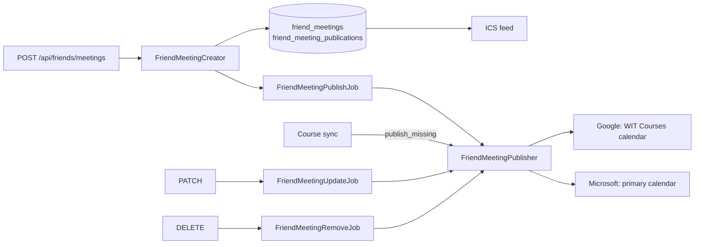

# Friend meetings

The extension suggests times when a person and some friends are free. The person picks one time, and the app makes a calendar event from it. This is part of friends v6.

## The flag

The Flipper flag `friend_meeting_events` is off by default. Friends v6 waits on a privacy policy update, so do not turn on the flag for real users until that update is live. While the flag is off for a person, every route below answers 404 for that person.

Turn on the flag for one test account first in the Flipper UI (`/admin/flipper`). Enter the account's email or `usr_` id: the app saves the gate as `User;<id>`. The extension can read the flag as `friendMeetingEvents` from `GET /api/user/feature_flags`.

## Routes

All routes use the extension's bearer token.

| Route | Who | What |
| --- | --- | --- |
| `GET /api/friends/meetings?start=&end=` | anyone | The person's meetings and the meetings that invited them, with each occurrence in the range. |
| `POST /api/friends/meetings` | anyone | Make a meeting. |
| `GET /api/friends/meetings/:id` | owner, invitee | One meeting. |
| `PATCH /api/friends/meetings/:id` | owner | Change the title, place, or time of the whole series. |
| `DELETE /api/friends/meetings/:id` | owner | Delete the meeting and its provider events. |
| `DELETE /api/friends/meetings/:id/attendance` | invitee | Leave the meeting. |

A meeting that the person cannot see answers 404. An invitee who tries to change or delete a meeting gets 403. An owner who tries to leave their own meeting gets 403.

## Make a meeting

`POST /api/friends/meetings`

```json
{
  "title": "Study group",
  "start_time": "2026-10-14T15:00:00-04:00",
  "end_time": "2026-10-14T16:00:00-04:00",
  "location": "Library",
  "friend_ids": ["usr_abc123"],
  "frequency": "weekly",
  "invite_friends": true,
  "destinations": ["google", "ics"]
}
```

| Field | Required | Notes |
| --- | --- | --- |
| `title` | yes | 200 characters at most. |
| `start_time`, `end_time` | yes | ISO 8601 with a UTC offset. The end must be after the start, and 12 hours at most after it. |
| `friend_ids` | yes | 1 to 20 ids from `GET /api/friends`. Each one must be an accepted friend. |
| `location` | no | 200 characters at most. |
| `frequency` | no | `one_time` (the default) or `weekly`. |
| `invite_friends` | no | `false` by default. When `true`, the friends get an invitation. |
| `destinations` | no | The places for the meeting: `google`, `microsoft`, `ics`. Each provider must have a connected course calendar. `ics` is always allowed. Without this field, the meeting goes to every connected course calendar and the ICS feed. |
| `idempotency_key` | no | The same as the `Idempotency-Key` header. 255 characters at most. |

A weekly meeting repeats on the day of its start time until the last day of the term that holds that day. Between terms, the app uses the current term. A weekly meeting must start on or before the last day of that term.

Invitations go out only from the first provider in `destinations` that can send them (`google` or `microsoft`). The ICS feed lists the friends as attendees, but a feed cannot send an invitation.

### Retries

Send an `Idempotency-Key` header (or the `idempotency_key` field) with each new meeting. A retry with the same key from the same person answers `200` with the first meeting. The retry makes no new meeting and sends no new invitations. The first request answers `201`.

## The meeting object

The create, show, and update routes answer `{ "meeting": { ... } }`:

```json
{
  "id": "fmt_xxxxxxxxxxxx",
  "title": "Study group",
  "location": "Library",
  "start_time": "2026-10-14T15:00:00-04:00",
  "end_time": "2026-10-14T16:00:00-04:00",
  "time_zone": "America/New_York",
  "frequency": "weekly",
  "recurrence": "RRULE:FREQ=WEEKLY;BYDAY=WE;UNTIL=20261219T045959Z",
  "repeat_until": "2026-12-18",
  "invite_friends": true,
  "role": "owner",
  "can_edit": true,
  "can_delete": true,
  "can_leave": false,
  "owner": { "id": "usr_owner", "name": "Sample Owner" },
  "friends": [{ "id": "usr_abc123", "name": "Sample Friend" }],
  "destinations": ["google", "ics"],
  "publications": [
    { "provider": "google", "status": "queued", "invitation_status": "queued" },
    { "provider": "ics", "status": "published", "invitation_status": "not_requested" }
  ]
}
```

- `start_time` and `end_time` are the first occurrence. `recurrence` is `null` for a one-time meeting.
- `role` is `owner` or `invitee`. Only the owner gets `can_edit` and `can_delete`. Only an invitee gets `can_leave`.
- `destinations` and `publications` are empty for an invitee, because they are the owner's own calendars.

### Publication status

Each place has one row in `publications`.

| `status` | Meaning |
| --- | --- |
| `queued` | A background job writes the event soon. |
| `published` | The event is in the calendar. The ICS row is `published` at once. |
| `failed` | The last try failed. The job tries again, and each course sync puts back a missing event. A provider that is no longer connected also shows `failed`. |
| `removed` | The person disconnected the provider, and the app deleted the event. The event comes back after the person connects the provider again. |

| `invitation_status` | Meaning |
| --- | --- |
| `not_requested` | This place does not send the invitations. |
| `queued` | This place sends the invitations, and they did not go out yet. |
| `sent` | The provider sent the invitations. |
| `cancelled` | A disconnect deleted the event, so the friends got a cancellation. A reconnect sends the invitations again. |
| `failed` | The last try failed before the invitations went out. |

## List meetings

`GET /api/friends/meetings?start=2026-10-12&end=2026-10-26`

`start` and `end` are ISO 8601 dates (the start of that day in `America/New_York`) or times with a UTC offset. `end` must be after `start`, and the range can be 366 days at most. A bad range answers `400`.

```json
{
  "meetings": [{ "id": "fmt_xxxxxxxxxxxx", "role": "owner", "...": "the meeting object" }],
  "occurrences": [
    {
      "id": "fmt_xxxxxxxxxxxx:2026-10-14T19:00:00Z",
      "meeting_id": "fmt_xxxxxxxxxxxx",
      "start_time": "2026-10-14T15:00:00-04:00",
      "end_time": "2026-10-14T16:00:00-04:00"
    }
  ]
}
```

- The occurrence id is the meeting id and the occurrence start in UTC. It stays the same until the owner moves the meeting.
- A weekly meeting keeps its local time across a daylight saving change.
- The route reads only the database, so it works for a person who uses only the ICS feed.
- An invited friend sees a meeting when the owner set `invite_friends`. The friend does not accept in the app: the provider invitation handles the answer.

## Change a meeting

`PATCH /api/friends/meetings/:id` with any of `title`, `location`, `start_time`, `end_time`. The change applies to every occurrence. A weekly meeting that moves to a new day can move to the term that holds the new day. The answer is the meeting, with each provider `queued` until the update job writes the change. The provider that sent the invitations tells the friends about the change.

## Delete a meeting

`DELETE /api/friends/meetings/:id` answers `204`. The meeting is gone from every route and the ICS feed at once. A job then deletes each provider event, and the provider sends each invited friend a cancellation. No later sync puts the meeting back.

- The job retries network, server, rate limit, and permission errors with a growing wait.
- `FriendMeetingRemovalSweepJob` runs every hour. It starts the job again for each meeting that was cancelled over an hour ago and still exists.
- When the provider refuses the token, the event row stays and its publication shows `failed`. The removal finishes when the person connects the account again.

When a person deletes their account, the app deletes the provider events of their meetings first, while the tokens still work, so the friends get a cancellation.

## Invitations and leaving a meeting

There is no accept step in the app. An invited friend sees the meeting at once, and it counts as busy time in their busy blocks. The provider invitation (Google or Microsoft) is the RSVP.

`DELETE /api/friends/meetings/:id/attendance` answers `204`. The friend leaves the meeting. It is gone from their list, their busy blocks, and their ICS feed at once. For a meeting that has not ended, a job updates the provider events, so the owner sees that the friend left. A second call answers 404, because the friend can no longer see the meeting.

## Friends who are no longer friends

When a person removes a friend, the app takes each of them off the other's meetings, past meetings too, so neither can read the other's meetings any more. For a future meeting whose owner sent invitations, a job updates the provider event, and the provider sends the removed person a cancellation.

## Disconnect and reconnect

When a person disconnects Microsoft, the app deletes the meeting events from the primary calendar, and Exchange sends the friends a cancellation. The Microsoft publication then shows `removed`, and its invitation status shows `cancelled`. The meeting stays. After the person connects Microsoft again, the next sync puts the event back and sends the invitations again. A new token also starts `FriendMeetingResumeJob`, which finishes any removal that a refused token stopped.

## Where the event goes



- **Google**: the "WIT Courses" calendar, written with the person's own token.
- **Microsoft**: always the person's primary calendar, whatever the placement of the course events. Graph cannot move an event between calendars, and a deleted meeting sends its attendees a cancellation. In the primary calendar, a placement move or a course calendar that the person deleted never touches the meeting. Exchange also reads free and busy time from the primary calendar only.
- **ICS feed**: every meeting that has not ended and that has `ics` in its destinations.

Each provider event is a `calendar_events` row with `friend_meeting_id`. A course sync does not touch these rows. After each course sync, the app puts back a meeting that is missing from a picked calendar. A meeting that comes back after the invitations went out comes back without attendees, so friends never get a second invitation.
