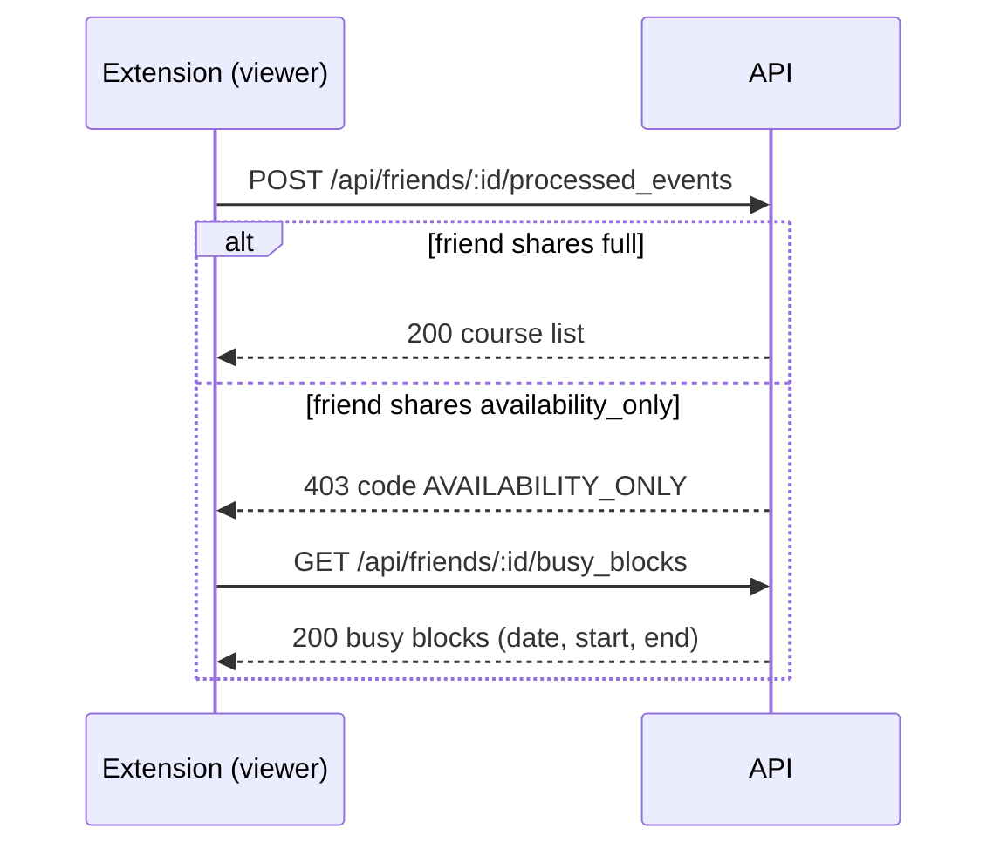

# Friends: share availability without course details

A person can let a friend find a common free time without showing the course list. Each side of a friendship sets a visibility level for its own schedule toward the other side:

- `full`: the friend can read the course list (`processed_events`). This is the default, and the level of each friendship from before this feature.
- `availability_only`: the friend can read only busy blocks (date, start, end). `processed_events` answers 403.

The two sides are independent. If Ada sets `availability_only` toward Grace, Grace sees only Ada's busy blocks, but Ada still sees Grace's courses until Grace changes her own level.

## Feature flag

The flag `friends_availability_only` (`friendsAvailabilityOnly` in `/api/user/feature_flags`) is off by default. The privacy policy must change first (calendar-website#20). Do not turn on the flag for real users before that.

The flag gates the actions that set a level. While the flag is off for the signed-in user:

- `PATCH /api/friends/:friend_id/visibility` answers 404.
- The `visibility` param on send and accept requests answers 404 (API) or an alert (dashboard). Nothing is created or accepted.
- The dashboard does not show the sharing form or the level choice, and `PATCH /dashboard/friends/:id/visibility` answers 404.

The read routes `GET /api/friends/:friend_id/visibility` and `GET /api/friends/:friend_id/busy_blocks` work when the friend shares `availability_only`, whatever the flag of the viewer. When the friend shares `full`, they answer 404 while the flag is off for the viewer. `GET /api/user/busy_blocks` reads only the data of the signed-in user and has no flag.

The 403 on `processed_events` and `is_processed` does not depend on the flag. A level that a person set while the flag was on stays in force when the flag goes off.

## Error codes

A 403 from the friend routes has a `code`:

- `NOT_FRIENDS`: the user is not an accepted friend.
- `AVAILABILITY_ONLY`: the friend shares only availability.

## Flow



## API

All routes need the usual API token.

### GET /api/friends/:friend_id/visibility

Returns both levels, as seen by the signed-in user. `mine` is the level the user set for their own schedule. `theirs` is the level the friend set. `theirs` decides what the user can read.

```json
{ "friend_id": "usr_...", "mine": "full", "theirs": "availability_only" }
```

### PATCH /api/friends/:friend_id/visibility

Body: `{ "visibility": "full" }` or `{ "visibility": "availability_only" }`. Sets the level of the signed-in user's own schedule toward this friend. The answer has the same shape as `GET`.

- 400: `visibility` is missing.
- 403: the user is not an accepted friend.
- 422: `visibility` is not `full` or `availability_only`.

### Choose a level when you send or accept a request

`POST /api/friends/requests` and `POST /api/friends/requests/:request_id/accept` take an optional `visibility` param (`full` or `availability_only`). It sets only the level of the user who acts. The default is `full`. The param answers 404 while the flag is off for that user, and 422 for an unknown value. The dashboard forms send the same param.

### GET /api/user/busy_blocks

The same query and answer as the friend route, for the signed-in user. The extension can compute a free time with the same logic for both sides.

### GET /api/friends/:friend_id/busy_blocks

Query: `start_date` and `end_date`, in `YYYY-MM-DD` format. Both are optional. `start_date` defaults to today, and `end_date` to six days after `start_date`. The range is 120 days or fewer.

Every accepted friend can read busy blocks, whatever the friend's level. While the flag is off for the viewer, this holds only for a friend who shares `availability_only`.

```json
{
  "time_zone": "America/New_York",
  "start_date": "2026-10-05",
  "end_date": "2026-10-11",
  "busy": [
    { "date": "2026-10-05", "weekday": "monday", "start": "09:00", "end": "10:15" }
  ]
}
```

- Times are wall-clock times in `time_zone`.
- Blocks on one date that overlap or touch are merged into one block.
- Class meetings do not appear on a day with no classes (a holiday, a study day, or the finals period). Final exams appear on their date.
- 400: a date has the wrong format, `end_date` is before `start_date`, or the range is too long.
- 403 `NOT_FRIENDS`: the user is not an accepted friend.

### POST /api/friends/:friend_id/is_processed

For a friend who shares `availability_only`, the answer is the same 403 as for `processed_events`. Else a friend would learn whether the user has enrollments in a term.

### POST /api/friends/:friend_id/processed_events

Unchanged for a friend who shares `full`. For a friend who shares `availability_only`:

```json
{ "error": "This friend shares only availability", "code": "AVAILABILITY_ONLY", "visibility": "availability_only" }
```

with status 403.

## Code

- `BusyBlocks` (`app/services/busy_blocks.rb`) computes the blocks for one user and a date range. It loads no course record. Each kind of busy time is a source in `BusyBlocks.sources` (`MeetingSource`, `FinalExamSource`). A source is a class with `.call(user, from, to)` that returns `BusyBlocks::Interval` values. To add meetings (#674), add a source to that list. Other features, such as a one-time meeting link (#652), can use the service.
- `Friendship.accepted_between(user, other)` is the one lookup of an accepted friendship. The API and the dashboard use it.
- `BusyBlocksSerializer` and `FriendshipVisibilitySerializer` render the API answers.
- `Friendship#visibility_set_by`, `#update_visibility_for!` and `#full_schedule_visible_to?` hold the rules.
- The dashboard friend page shows the busy blocks for one week in place of the course list when the friend shares only availability.
