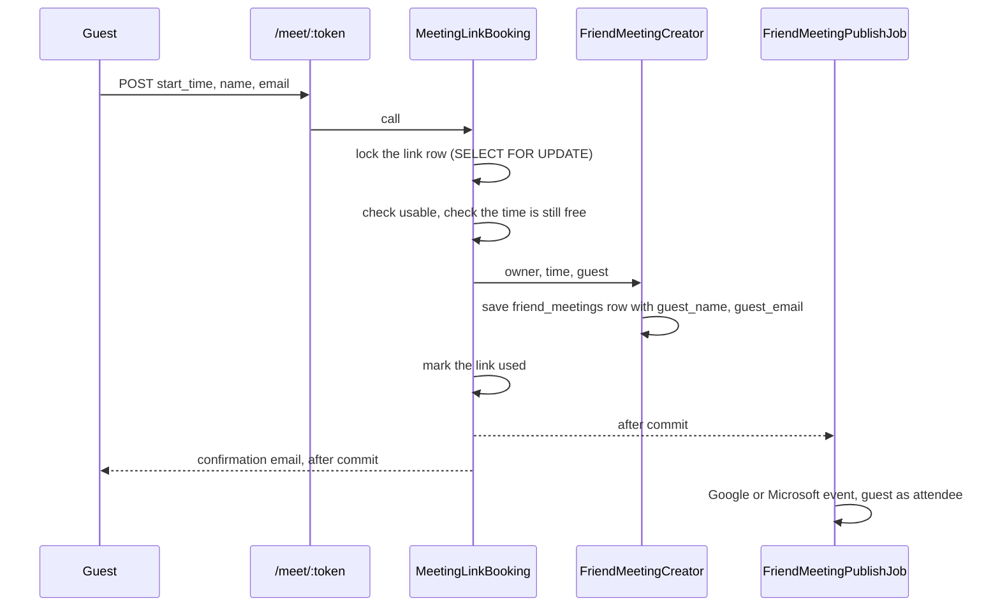

# One-time meeting links

A person makes a link and shares it with someone who is not a friend in the app. For example: a professor, a TA, or a project partner from another class who does not use the app. That person opens the link, sees only the free times, and picks one. The app then makes the meeting in the owner's calendar, and the link stops working.

## The flag

The Flipper flag `meeting_links` is off by default. The app checks the flag for the link owner, on the API, on the dashboard page, and on the public page. While the flag is off, every route answers 404, and the public page shows "This link no longer works".

Turn on the flag for one test account first in the Flipper UI (`/admin/flipper`). Enter the account's email or `usr_` id: the app saves the gate as `User;<id>`. The extension can read the flag as `meetingLinks` from `GET /api/user/feature_flags`.

## The owner: API

All routes need the extension's bearer token.

### Make a link

`POST /api/meeting_links`

```json
{
  "title": "Project check-in",
  "starts_on": "2026-10-08",
  "ends_on": "2026-10-16",
  "duration_minutes": 30,
  "expires_at": "2026-10-12T17:00:00-04:00"
}
```

| Field | Required | Notes |
| --- | --- | --- |
| `starts_on`, `ends_on` | yes | ISO 8601 dates. `starts_on` is today or later. The range is 30 days at most. |
| `duration_minutes` | yes | One of 15, 30, 45, 60, 90, 120. |
| `title` | no | 200 characters at most. Without a title, the event is "Meeting with <guest name>". |
| `expires_at` | no | ISO 8601 with a UTC offset. In the future, and 60 days from now at most. The default is the end of `ends_on`. |

A person can have 20 active links at most.

The answer is `201`:

```json
{
  "meeting_link": {
    "id": "mlk_xxxxxxxxxxxx",
    "title": "Project check-in",
    "starts_on": "2026-10-08",
    "ends_on": "2026-10-16",
    "duration_minutes": 30,
    "expires_at": "2026-10-12T17:00:00-04:00",
    "status": "active",
    "created_at": "2026-10-07T12:00:00-04:00",
    "booking": null,
    "url": "https://calendar.witcc.dev/meet/<token>"
  }
}
```

`url` is in this answer only. The app stores only a SHA-256 digest of the token, so it cannot show the link again. Show the URL to the person at once.

### List links

`GET /api/meeting_links` answers `200` with `{ "meeting_links": [ ... ] }`, newest first. Each item has the same fields as above, without `url`. `status` is `active`, `used`, `revoked`, or `expired`. A used link has a `booking`:

```json
{
  "meeting_id": "fmt_xxxxxxxxxxxx",
  "start_time": "2026-10-08T10:00:00-04:00",
  "end_time": "2026-10-08T10:30:00-04:00",
  "guest_name": "Sample Guest",
  "guest_email": "guest@example.com"
}
```

### Revoke a link

`DELETE /api/meeting_links/:id` answers `200` with `{ "meeting_link": { ... } }`. A used link stays used and keeps its meeting. To cancel the meeting, delete the event in the calendar.

| Status | When |
| --- | --- |
| `400` | A required field is missing, or a date or time is not ISO 8601. |
| `401` | The token is missing or not valid. |
| `404` | The flag is off for the person, or the link is not the person's link. |
| `422` | The link is not valid. `error` says why. |

## The owner: dashboard

`/dashboard/meeting_links` makes, lists, and revokes links. The friends page links to it while the flag is on. The new URL shows once, on the page after the link is made.

## The guest: public page

`GET /meet/:token` shows the free times. Sign-in is optional.

- **Not signed in**: the page shows the owner's free times.
- **Signed in** with an account of this app: the page shows only the times when both people are free. The name and email are filled in.

The page shows the owner's name, the title, the meeting length, and start times. It shows no course data. Free times are on weekdays, from 8:00 AM to 9:00 PM Eastern Time, every 30 minutes, and at least one hour from now. Busy time is the person's class times (`BusyBlocks`) and their friend meetings.

`POST /meet/:token` with `start_time`, `name`, and `email` books the time. The page then shows a confirmation to that browser only.

An unknown, expired, used, or revoked token gets the same 404 page, "This link no longer works". The page does not say whether the token ever existed. The page sends `Referrer-Policy: no-referrer` and `X-Robots-Tag: noindex, nofollow`, and robots.txt disallows `/meet/`.

## Booking



The lock makes the pick atomic. When two guests pick at the same moment, the second one waits, then finds the link used.

The meeting uses the friend meeting path (see [friend-meetings.md](friend-meetings.md)), with the guest as the one invitee:

- **Google or Microsoft**: the provider sends the guest a calendar invitation.
- **ICS feed only**: the event is in the owner's feed, with the guest as an attendee. A feed cannot send an invitation.
- **Every guest** gets a confirmation email from the app (`MeetingLinkMailer#booked`), with replies to the owner. The email says if a calendar invitation also comes.

## Rate limits

| Throttle | Limit |
| --- | --- |
| `meet/ip` | 30 requests a minute for each IP address, on `/meet/*`. |
| `meet/pick/ip` | 5 picks in 10 minutes for each IP address. |
| `meet/token` | 60 requests an hour for each link, across IP addresses. The cache key is a digest of the token. |
