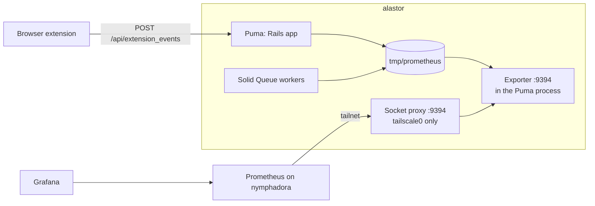

# Metrics

The backend sends its metrics to the Grafana server at `telemetry.hogwarts.dev`. Prometheus on nymphadora reads the metrics from alastor over the tailnet. The public internet cannot read them.



## How the exporter runs

- `config/puma.rb` starts the exporter when `PROMETHEUS_EXPORTER_PORT` is set. Without that variable, the app sends no metrics and opens no port.
- The exporter is a small web server inside the Puma process, on its own port. It does not go through Rails, Thruster, or Traefik.
- The Puma control app starts with the exporter, on `tmp/pumactl.sock`. The exporter reads the Puma thread counts from it.
- Solid Queue workers run in processes that Puma forks. Every process writes its values to files in `tmp/prometheus` (or `PROMETHEUS_DATA_DIR`), and the exporter adds them up. The container gets a new `tmp` on each restart, so no old values stay.

The host side lives in [jaspermayone/infra](https://github.com/jaspermayone/infra):

| File | What it does |
| --- | --- |
| `modules/wit-calendar/default.nix` | `metricsPort` publishes the exporter on loopback, proxies it to the tailnet, and opens the port on `tailscale0` only. |
| `hosts/nymphadora/configuration.nix` | The `wit-calendar` scrape job. |
| `modules/telemetry/dashboards/wit-calendar.json` | The Grafana dashboard. |
| `tailscale/policy.hujson` | The grant from `tag:app` to `tag:ingress` on TCP 9394. |

## Metrics

| Metric | Type | Labels | Source |
| --- | --- | --- | --- |
| `rails_requests_total` | counter | `controller`, `action`, `status`, `format`, `method` | yabeda-rails |
| `rails_request_duration_seconds` | histogram | same as above | yabeda-rails |
| `rails_view_runtime_seconds`, `rails_db_runtime_seconds` | histogram | same as above | yabeda-rails |
| `puma_busy_threads`, `puma_pool_capacity`, `puma_backlog`, `puma_max_threads` | gauge | `index` | yabeda-puma-plugin |
| `activejob_enqueued_total`, `activejob_executed_total`, `activejob_success_total` | counter | `queue`, `activejob`, `executions` | yabeda-activejob |
| `activejob_failed_total` | counter | also `failure_reason` | yabeda-activejob |
| `activejob_runtime_seconds`, `activejob_latency_seconds` | histogram | `queue`, `activejob`, `executions` | yabeda-activejob |
| `calendar_users` | gauge | | `AppMetrics` |
| `calendar_active_sessions` | gauge | | `AppMetrics` |
| `calendar_google_calendars` | gauge | | `AppMetrics` |
| `calendar_jobs` | gauge | `state`: `ready`, `scheduled`, `claimed`, `blocked`, `failed` | `AppMetrics` |
| `calendar_extension_events_total` | counter | `event`, `version`, `browser` | `ExtensionUsage` |

The request metrics skip the health checks (`/up` and OkComputer). The gauges are counted on each scrape. If one count fails, `AppMetrics` logs a warning and sets the others, so the scrape still succeeds.

## Extension events

The extension sends `POST /api/extension_events` with a JSON body:

```json
{ "events": ["schedule_import_succeeded"], "version": "4.0.1", "browser": "chrome" }
```

- The request has no token, and nothing in it identifies a student.
- `ExtensionUsage::EVENTS` lists the event names. The backend ignores other names.
- A version that is not in the `4.0.1` format gets the label `unknown`. After 50 different versions, a new version gets `other`. A browser other than `chrome`, `firefox`, or `edge` gets `other`. These limits stop a client from making an unlimited number of series.
- One request counts 50 events at most.
- Rack::Attack allows 120 requests a minute from one IP address, in the `api/extension-events` throttle. The events do not use the 20-a-minute anonymous API budget, because many students share one campus address and sign-in needs that budget.
- Students can turn the events off in the extension Settings. Firefox sends events only when the student allows the optional `technicalAndInteraction` data permission.

To add an event:

1. Add the name to `ExtensionUsage::EVENTS` here, and deploy.
2. Add the same name to `TELEMETRY_EVENTS` in the extension (`src/lib/telemetry.ts`), and call `track`.

If the extension ships first, the backend ignores the new name until step 1 is deployed.

## Try it locally

```bash
PROMETHEUS_EXPORTER_PORT=9394 bin/dev
curl -s localhost:9394/metrics | grep '^calendar_'
```
