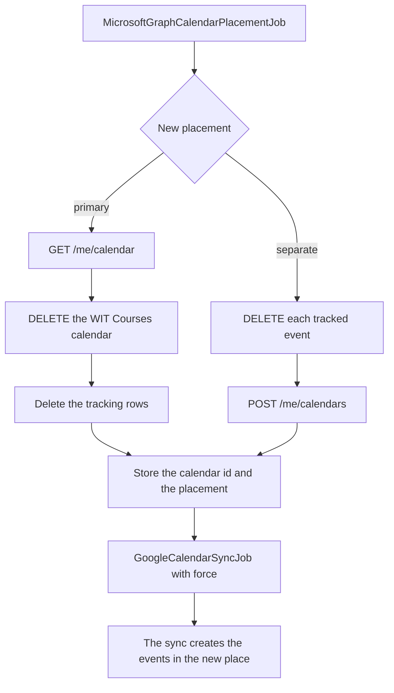
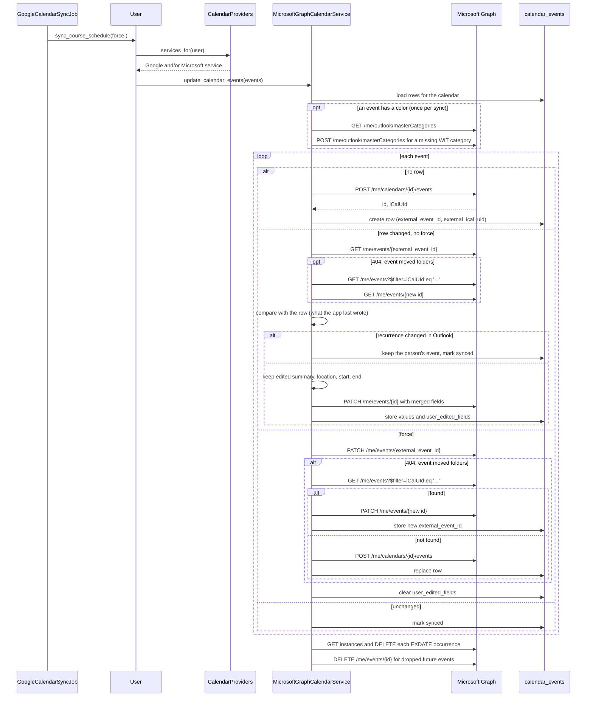

# Microsoft Graph calendar provider

The app can sync course events to a calendar in a person's Microsoft 365 mailbox. Google Calendar stays the default provider. The Microsoft Graph provider is off by default.

## Admin consent is required first

The WIT Entra tenant does not let a person consent to this app. An admin of the WIT tenant must grant tenant-wide admin consent before anyone can connect. Without that consent, Microsoft stops the sign-in with `AADSTS65001` or an "Approval required" page.

Do not turn on the flag for real users until IT confirms the consent.

## The app registration

The club owns the app registration. It is in the club's own Entra tenant, not in the WIT tenant. WIT IT does not register or operate anything. IT only grants admin consent, which makes an enterprise application in the WIT tenant. IT can review, limit or delete that enterprise application at any time. This is the usual model for a vendor application.

The production registration is "WIT Calendar", with the client id `11846a97-8d14-4328-ab5d-3add1fb6aa64`. A client id is not a secret. The same registration serves "Sign in with Microsoft" (`docs/microsoft-sign-in.md`).

To make a registration for a different environment:

1. In the Entra admin center of the club tenant, create an app registration.
2. For "Supported account types", select "Accounts in any organizational directory". A single-tenant registration in the club tenant cannot reach a WIT mailbox.
3. Add the web redirect URI `https://calendar.witcc.dev/auth/microsoft_graph/callback`. For local work, add `http://localhost:3000/auth/microsoft_graph/callback`.
4. Add the delegated Microsoft Graph permissions:
   - `Calendars.ReadWrite`
   - `MailboxSettings.ReadWrite` (reads and creates the Outlook categories that color events)
   - `offline_access`
   - `openid`, `email`, `profile` (sign-in only, no Graph data)
5. Do not add an application permission. An application permission gives access to each mailbox in a tenant, and this provider acts only for a person who connects.
6. Set the publisher domain to a domain that the tenant has verified, for example `witcc.dev`.
7. Create a client secret. Put the value in the secret store, not in the repo. A secret expires after 24 months at most, so record the expiry date.
8. Add a second maintainer as an owner of the registration.

An admin of the WIT tenant grants consent with this URL:

```
https://login.microsoftonline.com/<WIT tenant id>/adminconsent?client_id=<client id>
```

After the consent, Microsoft sends the admin to a callback URL of the app. While the provider is off, that page answers 404. The consent is still complete.

## Configure the app

Set these environment variables. Keep the real values in the secret store, not in the repo.

| Variable | Required | Value |
| --- | --- | --- |
| `MICROSOFT_CLIENT_ID` | Yes | `YOUR_MICROSOFT_CLIENT_ID` |
| `MICROSOFT_CLIENT_SECRET` | Yes | `YOUR_MICROSOFT_CLIENT_SECRET` |
| `MICROSOFT_TENANT_ID` | In production | The WIT tenant id (a GUID), not the club tenant id. It limits connections to WIT accounts. The default is `organizations`. For a local test with a personal Outlook.com account, use `common` and a registration that allows personal accounts. |
| `MICROSOFT_REDIRECT_URI` | No | The registered callback URL. The default is the request host plus `/auth/microsoft_graph/callback`. |

The Cloudflare Worker must send `/auth/microsoft_graph` and `/auth/microsoft_graph/callback` to Rails, like `/auth/google_oauth2/callback`.

## Turn on the provider

The provider runs only when both conditions are true:

1. `MICROSOFT_CLIENT_ID` and `MICROSOFT_CLIENT_SECRET` are set.
2. The Flipper flag `microsoft_graph_calendar` is on for the person.

Turn on the flag for one test account first in the Flipper UI (`/admin/flipper`). The extension can read the flag as `microsoftGraphCalendar` from `GET /api/user/feature_flags`.

## Connect a calendar

1. The extension calls `POST /api/user/microsoft_calendar`. The response holds `oauth_url`.
2. The browser opens `oauth_url`. The app sends the person to Microsoft with PKCE.
3. Microsoft returns to `/auth/microsoft_graph/callback`. The Microsoft account must be the person's own WIT account: its email must equal the email of the WIT-Calendar account. The extension opens this flow in a tab with no session, so the state alone does not prove who is at the browser. Without this rule, a person could send their start URL to someone else and get that person's mailbox on their own account. Development skips the rule, so a personal Outlook.com account can test the provider.
4. The app stores the tokens in `oauth_credentials` with `provider = "microsoft"`.
5. The app creates a "WIT Courses" calendar in the mailbox, or uses the primary calendar (see "Where the events go"), and starts a sync.

While the provider is off, all three endpoints answer 404.

## Where the events go

A person chooses one of two placements. The `calendars.placement` column holds the choice.

| Placement | Where the events go | Free and busy time | Disconnect |
| --- | --- | --- | --- |
| `separate` (default) | A "WIT Courses" calendar that the app creates | Not affected | The app deletes the calendar |
| `primary` | The person's main calendar | Classes show as busy | The app deletes each event that it tracks |

Exchange works out free and busy time from the primary calendar only. The Scheduling Assistant does not read a second calendar, even a shared one. A person who wants a class to block a meeting request must use `primary`.

- A timed event has `showAs: "busy"`. An all-day event has `showAs: "free"`. The app sets `showAs` on a create and on a forced sync. After it reads an event, it keeps the value that the person set.
- The app never deletes a primary calendar. `MicrosoftGraphCalendarService#delete_calendar` refuses a calendar id that a row tracks as primary. A `CourseCalendar` row with the `primary` placement does not start `MicrosoftGraphCalendarDeleteJob`.
- Only a Microsoft calendar can be `primary`. The service account owns a Google course calendar, so the app cannot reach the person's main Google calendar.

### Choose the placement

- At the first connection: send `placement` with `POST /api/user/microsoft_calendar`. The value goes into the signed state, and the callback uses it.
- Later: `PATCH /api/user/microsoft_calendar` with `placement`, or the button in the "Outlook Calendar" section of the dashboard. Both start `MicrosoftGraphCalendarPlacementJob` and answer before the move is complete. The API answers 202.
- `GET /api/user/oauth_credentials` gives the current `placement` of each connection, so a client can show it. The value is `nil` while the connection has no calendar.

## Disconnect

`DELETE /api/user/oauth_credentials/:id` removes one connection. The last Google credential stays, because it signs the person in and it is the only way the app reaches a Google calendar. Every Microsoft credential can go, even the only connection, because a person can sign in with a passkey or with Microsoft and use Outlook alone. The `removable` field of each row in the list says which rows the client may offer to disconnect.

### The move



- The job uses the concurrency group and key of `GoogleCalendarSyncJob`. A move and a sync for one person do not run at the same time.
- A failed step can run again, and the job tries 5 times. The job reads the primary calendar id before it deletes anything. A delete of a missing event or calendar counts as done. A move to `separate` stops while an event delete has failed, because the sync would update the old event in the primary calendar.
- One gap stays. If the process dies after Graph creates the separate calendar and before the row is saved, the next run creates a second, empty "WIT Courses" calendar. The app does not look for a calendar by name, because it could then adopt, and later delete, a calendar that the person made.
- Edits that the person made to class events in Outlook do not survive a move. The dashboard tells the person this before the move.
- On a disconnect with the `primary` placement, the app deletes each tracked event in the request, one Graph call for each event. A failed delete is logged, and that event stays in Outlook with its "WIT" category.

## Sync flow



## Differences from Google

- Graph has no RRULE or EXDATE. The provider sends a weekly `patternedRecurrence` and cancels each excluded occurrence after it creates or updates the series.
- Graph has one reminder per event. The provider sends the earliest reminder.
- Outlook colors events through categories, not a color id. The app stores an event color as a hex value, and any RGB color is allowed. Outlook has only preset colors. The provider finds the nearest of the 11 Google palette colors and uses its "WIT <color>" category with the closest preset color, for example "WIT Tomato" with `preset0`. It reads the master list once for each sync with `GET /me/outlook/masterCategories` and creates a missing category with `POST /me/outlook/masterCategories`. It does not change a category that the person already has. A normal sync keeps the person's other categories on the event. A forced sync sets only the WIT category when the event has a color.
- The master category list needs `MailboxSettings.ReadWrite`. If Graph answers 403, the event still gets the category name, and Outlook shows it without a color.
- Both providers keep edits that a person makes in their calendar. The Microsoft provider reads the event before a PATCH and compares it with the `calendar_events` row. A changed subject, location, start or end stays, and the field goes into `user_edited_fields`. A changed recurrence keeps the whole event. A forced sync writes the app's values again.
- Google counts any description as an edit. The row does not store the description that the app wrote, so the Microsoft provider does not compare descriptions. Template changes to the description still reach Outlook.
- The calendar belongs to the person's mailbox, not to a service account. When the person disconnects the account, the app deletes the "WIT Courses" calendar with `DELETE /me/calendars/{id}` before it removes the token. If Graph fails, the app logs the failure and the disconnect continues. The calendar then stays in Outlook, and the person can delete it there.
