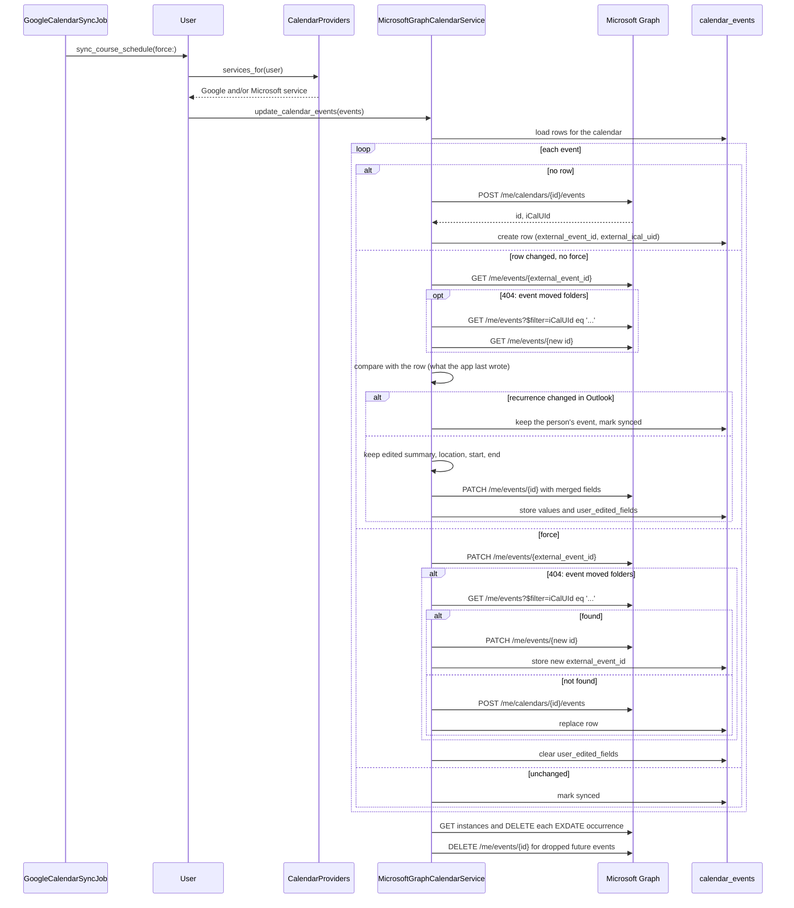

# Microsoft Graph calendar provider

The app can sync course events to a calendar in a person's Microsoft 365 mailbox. Google Calendar stays the default provider. The Microsoft Graph provider is off by default.

## Admin consent is required first

The WIT Entra tenant does not let users consent to Graph calendar scopes themselves. An IT admin must grant tenant-wide admin consent for the app registration before anyone can connect. Without that consent, Microsoft stops the sign-in with `AADSTS65001` or an "Approval required" page.

Do not turn on the flag for real users until IT confirms the consent.

## Register the app in Entra ID

1. Create a web app registration in the Entra admin center.
2. Add the redirect URI `https://calendar.witcc.dev/auth/microsoft_graph/callback`. For local work, add `http://localhost:3000/auth/microsoft_graph/callback`.
3. Add the delegated Microsoft Graph permissions:
   - `Calendars.ReadWrite`
   - `offline_access`
   - `openid`, `email`, `profile` (sign-in only, no Graph data)
4. Create a client secret.
5. Ask an IT admin to grant admin consent for the permissions.

## Configure the app

Set these environment variables. Keep the real values in the secret store, not in the repo.

| Variable | Required | Value |
| --- | --- | --- |
| `MICROSOFT_CLIENT_ID` | Yes | `YOUR_MICROSOFT_CLIENT_ID` |
| `MICROSOFT_CLIENT_SECRET` | Yes | `YOUR_MICROSOFT_CLIENT_SECRET` |
| `MICROSOFT_TENANT_ID` | No | The WIT tenant id. The default is `organizations`. |
| `MICROSOFT_REDIRECT_URI` | No | The registered callback URL. The default is the request host plus `/auth/microsoft_graph/callback`. |

The Cloudflare Worker must send `/auth/microsoft_graph` and `/auth/microsoft_graph/callback` to Rails, like `/auth/google_oauth2/callback`.

## Turn on the provider

The provider runs only when both conditions are true:

1. `MICROSOFT_CLIENT_ID` and `MICROSOFT_CLIENT_SECRET` are set.
2. The Flipper flag `microsoft_graph_calendar` is on for the person.

Turn on the flag for one test account first in the Flipper UI (`/admin/flipper`). The extension can read the flag as `microsoftGraphCalendar` from `GET /api/user/feature_flags`.

## Connect a calendar

1. The extension calls `POST /api/user/microsoft_calendar`. The response holds `oauth_url`.
2. The browser opens `oauth_url`. The app sends the person to Microsoft with PKCE.
3. Microsoft returns to `/auth/microsoft_graph/callback`. The app stores the tokens in `oauth_credentials` with `provider = "microsoft"`.
4. The app creates a "WIT Courses" calendar in the mailbox and starts a sync.

While the provider is off, all three endpoints answer 404.

## Sync flow

## Differences from Google

- Graph has no RRULE or EXDATE. The provider sends a weekly `patternedRecurrence` and cancels each excluded occurrence after it creates or updates the series.
- Graph has one reminder per event. The provider sends the earliest reminder.
- Event colors are not sent. Outlook colors come from categories.
- Both providers keep edits that a person makes in their calendar. The Microsoft provider reads the event before a PATCH and compares it with the `calendar_events` row. A changed subject, location, start or end stays, and the field goes into `user_edited_fields`. A changed recurrence keeps the whole event. A forced sync writes the app's values again.
- Google counts any description as an edit. The row does not store the description that the app wrote, so the Microsoft provider does not compare descriptions. Template changes to the description still reach Outlook.
- The calendar belongs to the person's mailbox, not to a service account. When the person disconnects the account, the app cannot delete the calendar, because the token is gone.
