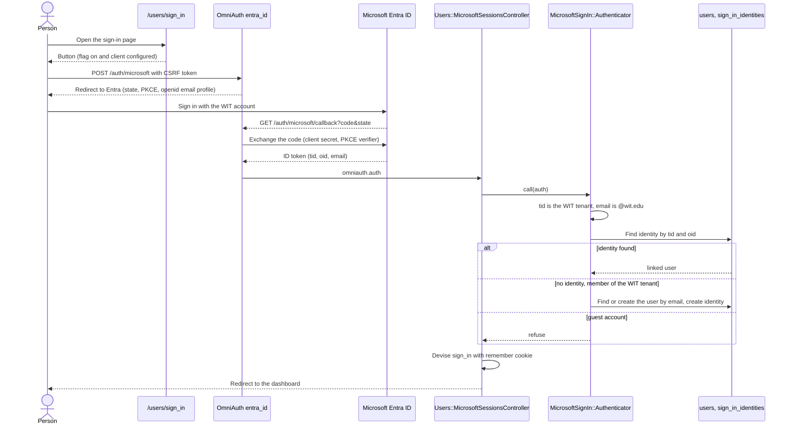

# Sign in with Microsoft

A person can sign in to the web dashboard with a WIT Microsoft account. The sign-in uses the `omniauth-entra-id` strategy (Microsoft Entra ID v2). It is off by default.

This page is about sign-in only. Calendar sync to a Microsoft 365 mailbox is a separate provider with its own flag and its own consent (see `docs/microsoft-graph-calendar.md`, from PR #612).

## Register the app in Entra ID

Use the same app registration as the Microsoft Graph calendar provider. One registration serves both.

1. Open the app registration in the Entra admin center.
2. Add the redirect URI `https://calendar.witcc.dev/auth/microsoft/callback`. For local work, add `http://localhost:3000/auth/microsoft/callback`.
3. Add the delegated permissions `openid`, `email`, and `profile`. The sign-in does not call Microsoft Graph, so it does not need `User.Read`. Microsoft can still add `User.Read` to the consent screen.
4. Create a client secret, if the registration does not have one.

## Consent

The sign-in asks only for `openid email profile`. These scopes, and `User.Read`, are usually low-impact, and many tenants let users consent to them. The WIT tenant consent policy is not verified. The sign-in can still need approval from WIT IT. If Microsoft shows "Approval required" or `AADSTS65001`, ask IT to grant consent for these scopes.

The sign-in does not ask for calendar scopes. Calendar access needs tenant admin consent, and the sign-in must work without it.

## Configure the app

Set these environment variables. Keep the real values in the secret store, not in the repo.

| Variable | Required for sign-in | Value |
| --- | --- | --- |
| `MICROSOFT_CLIENT_ID` | Yes | `YOUR_MICROSOFT_CLIENT_ID` |
| `MICROSOFT_CLIENT_SECRET` | Yes | `YOUR_MICROSOFT_CLIENT_SECRET` |
| `MICROSOFT_TENANT_ID` | Yes | `YOUR_WIT_TENANT_ID` (a GUID) |

`MICROSOFT_TENANT_ID` defaults to `organizations`, and the calendar provider can use that default. Sign-in cannot. The strategy checks the ID token issuer against the tenant, and the app trusts an email only from the WIT tenant. While the tenant is not a GUID, the sign-in counts as not configured.

The Cloudflare Worker must send `/auth/microsoft` and `/auth/microsoft/callback` to Rails, like `/auth/google_oauth2/callback`. It must also send `/auth/failure`.

## Turn on the sign-in

The "Sign in with Microsoft" button shows, and the routes answer, only when both conditions are true:

1. The three environment variables above are set, and the tenant is a GUID.
2. The Flipper flag `microsoft_sign_in` is fully on.

The flag is checked with no actor, because nobody is signed in yet. Enable it with "Fully enable" in the Flipper UI (`/admin/flipper`). Enabling it for a user, a group, or a percentage of actors has no effect.

While the sign-in is off, `POST /auth/microsoft` and `GET /auth/microsoft/callback` answer 404. `GET /auth/microsoft` always answers 404, because only a POST with a CSRF token starts the sign-in.

## Sign-in flow

## Linking rule

1. The token must come from the WIT tenant: the `tid` claim equals `MICROSOFT_TENANT_ID`.
2. The email must be a `@wit.edu` address. The app reads the `email` claim, then `preferred_username`.
3. An identity with the same `tid` and `oid` signs in its user. The email is not part of this lookup, because it can change.
4. With no identity, the email decides the account, like the Google sign-in. The first sign-in creates the account. A matching account gets linked. The app trusts the email only for a member of the WIT tenant, because WIT owns `wit.edu` in that tenant.
5. A guest account in the WIT tenant has an `idp` claim that names another identity provider. Its email comes from outside WIT, so the app refuses it and links nothing.

Identities live in `sign_in_identities`, not in `oauth_credentials`. They hold no tokens.

## Sessions

The sign-in opens a Devise cookie session with a remember cookie, like the Google and passkey dashboard sign-ins. It issues no API token and no `UserSession` row.

A person can remove a Microsoft sign-in on the dashboard Settings page. Removing it ends no session. Sessions that Google or a passkey opened stay active.

## The extension

The extension does not use this sign-in. It signs in with `POST /api/user/onboard` (a Google authorization code) or with a passkey, and both return a token. A Microsoft sign-in for the extension would need a new token endpoint.
