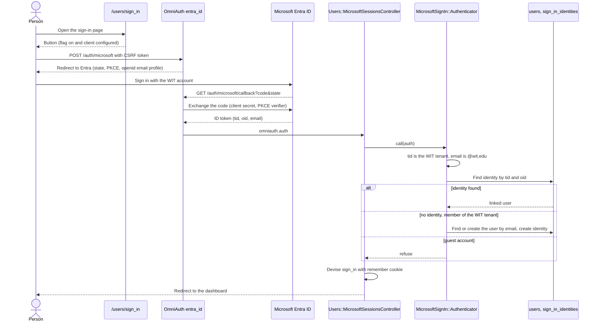

# Sign in with Microsoft

A person can sign in to the web dashboard with a WIT Microsoft account. The sign-in uses the `omniauth-entra-id` strategy (Microsoft Entra ID v2). It is off by default.

This page is about sign-in only. Calendar sync to a Microsoft 365 mailbox is a separate provider with its own flag and its own consent (see `docs/microsoft-graph-calendar.md`, from PR #612).

## Register the app in Entra ID

The club owns the app registration. It is in the club's own Entra tenant, not in the WIT tenant. WIT IT does not register or operate anything. IT only grants admin consent, which makes an enterprise application in the WIT tenant. This is the usual model for a vendor application.

The production registration is "WIT Calendar", with the client id `11846a97-8d14-4328-ab5d-3add1fb6aa64`. A client id is not a secret. One registration serves this sign-in and the Microsoft Graph calendar provider.

To make a registration for a different environment:

1. In the Entra admin center of the club tenant, create an app registration.
2. For "Supported account types", select "Accounts in any organizational directory". A single-tenant registration in the club tenant cannot sign in a WIT account.
3. Add the web redirect URI `https://calendar.witcc.dev/auth/microsoft/callback`. For local work, add `http://localhost:3000/auth/microsoft/callback`.
4. Add the delegated permissions `openid`, `email`, and `profile`. The sign-in does not call Microsoft Graph, so it does not need `User.Read`. Microsoft can still add `User.Read` to the consent screen.
5. Set the publisher domain to a domain that the tenant has verified, for example `witcc.dev`. The consent screen shows it.
6. Create a client secret. Put the value in the secret store, not in the repo. A secret expires after 24 months at most, so record the expiry date.
7. Add a second maintainer as an owner of the registration.

## Consent

The sign-in needs admin consent from WIT IT. The sign-in asks only for `openid email profile`, but the scopes do not decide this. The WIT tenant lets a person consent only to an app from a verified publisher or to an app that is registered in the WIT tenant. This app is neither, so Microsoft shows "Approval required" or `AADSTS65001` until IT grants consent.

An admin of the WIT tenant grants consent with this URL. One consent covers this sign-in and the calendar provider, because both use one registration:

```
https://login.microsoftonline.com/<WIT tenant id>/adminconsent?client_id=<client id>
```

After the consent, Microsoft sends the admin to a callback URL of the app. While the features are off, that page answers 404. The consent is still complete.

The sign-in does not ask for calendar scopes. A person who only signs in gives the app no calendar access.

## Configure the app

Set these environment variables. Keep the real values in the secret store, not in the repo.

| Variable | Required for sign-in | Value |
| --- | --- | --- |
| `MICROSOFT_CLIENT_ID` | Yes | `YOUR_MICROSOFT_CLIENT_ID` |
| `MICROSOFT_CLIENT_SECRET` | Yes | `YOUR_MICROSOFT_CLIENT_SECRET` |
| `MICROSOFT_TENANT_ID` | Yes | The WIT tenant id (a GUID), not the club tenant id. People sign in through the WIT authority. |

`MICROSOFT_TENANT_ID` defaults to `organizations`, and the calendar provider can use that default. Sign-in cannot. The strategy checks the ID token issuer against the tenant, and the app trusts an email only from the WIT tenant. While the tenant is not a GUID, the sign-in counts as not configured.

The Cloudflare Worker must send `/auth/microsoft` and `/auth/microsoft/callback` to Rails, like `/auth/google_oauth2/callback`. It must also send `/auth/failure`.

## Turn on the sign-in

The "Sign in with Microsoft" button shows, and the routes answer, only when both conditions are true:

1. The three environment variables above are set, and the tenant is a GUID.
2. The Flipper flag `microsoft_sign_in` is fully on.

The flag is checked with no actor, because nobody is signed in yet. Enable it with "Fully enable" in the Flipper UI (`/admin/flipper`). Enabling it for a user, a group, or a percentage of actors has no effect.

While the sign-in is off, `POST /auth/microsoft` and `GET /auth/microsoft/callback` answer 404. `GET /auth/microsoft` always answers 404, because only a POST with a CSRF token starts the sign-in.

## Sign-in flow



## Linking rule

1. The token must come from the WIT tenant: the `tid` claim equals `MICROSOFT_TENANT_ID`.
2. The email must be a `@wit.edu` address. The app reads the `email` claim, then `preferred_username`.
3. An identity with the same `tid` and `oid` signs in its user. The email is not part of this lookup, because it can change.
4. With no identity, the email decides the account, like the Google sign-in. The first sign-in creates the account. A matching account gets linked. The app trusts the email only for a member of the WIT tenant, because WIT owns `wit.edu` in that tenant.
5. A guest account in the WIT tenant has an `idp` claim that names another identity provider. Its email comes from outside WIT, so the app refuses it and links nothing.

The app links an account by email with no second check. This gives the WIT tenant the same trust that the Google sign-in gives WIT Google Workspace: WIT IT decides who holds a `@wit.edu` address. A member cannot change their own `mail` or UPN value. If WIT gives an old address to a new person, that person gets the old account, with both providers.

Two Microsoft rules support this. The UPN domain of a member is always a domain that the tenant has verified. For a multi-tenant registration made after June 2023, Microsoft leaves out an `email` claim whose domain the tenant has not verified. Do not turn off `removeUnverifiedEmailClaim` on the registration.

Identities live in `sign_in_identities`, not in `oauth_credentials`. They hold no tokens. The tenant id and the account id are stored in lower case.

## Sessions

The sign-in opens a Devise cookie session with a remember cookie, like the Google and passkey dashboard sign-ins. It issues no API token and no `UserSession` row.

A person can remove a Microsoft sign-in on the dashboard Settings page. Removing it ends no session. Sessions that Google or a passkey opened stay active.

## The extension

The extension does not use this sign-in. It signs in with `POST /api/user/onboard` (a Google authorization code) or with a passkey, and both return a token. A Microsoft sign-in for the extension would need a new token endpoint.
