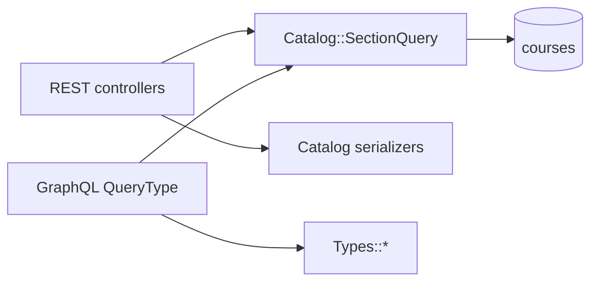
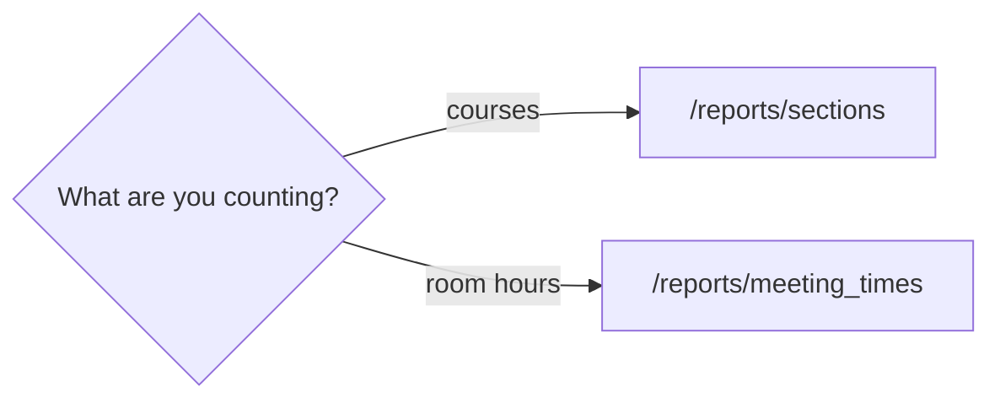

# WIT Calendar Course Catalog API

A read-only API for the WIT course schedule, published by WIT Calendar. It needs no authentication and no
API key.

This reference is also available as markdown at `/docs/api.md`. A client that
sends `Accept: text/markdown` to `/docs/api` gets the same markdown.
`/llms.txt` lists the main entry points for AI agents.

Machine descriptions of the API are also available:

| URL | Content |
| --- | --- |
| `/.well-known/api-catalog` | An [RFC 9727](https://www.rfc-editor.org/rfc/rfc9727) API catalog. It links each API to its description, this reference, and a health check. |
| `/docs/api/openapi.json` | An OpenAPI 3.1 description of the REST endpoints |
| `/docs/api/schema.graphql` | The GraphQL schema in SDL |

The API has three surfaces over the same data:

| Surface | Endpoint | Use it for |
| --- | --- | --- |
| REST | `GET /api/v1/catalog/...` | Simple requests, caching, curl |
| GraphQL | `POST /api/graphql` | One request for nested data |
| CSV reports | `GET /reports/...` | Excel and Power BI, no code |

Both surfaces use the same filter object, `Catalog::SectionQuery`. A filter
gives the same result on both.



## What the API contains

The API contains course schedule data only:

- Terms, subjects, and course sections
- Meeting days, times, buildings, and rooms
- Instructors, with Rate My Professors scores
- Final exam times

The API contains no user data. It does not return student records, grades, or
enrollments. It does not return instructor email addresses, phone numbers, or
office locations.

## Limits

- Responses are public and cacheable for 1 hour.
- Rate limit: 300 requests per minute per IP address.
- REST page size: 50 by default, 200 maximum.
- GraphQL page size: 50 by default, 200 maximum.
- GraphQL query depth: 12 maximum. Query cost: 500 maximum. See
  [Cost and limits](#cost-and-limits).
- GraphQL has no mutations.

### Rate limit headers

Every API response sends two headers from the IETF draft
[RateLimit header fields for HTTP](https://datatracker.ietf.org/doc/draft-ietf-httpapi-ratelimit-headers/).
Each list item is one policy:

```http
RateLimit-Policy: "req/ip";q=600;w=300, "catalog/ip";q=300;w=60
RateLimit: "req/ip";r=599;t=180, "catalog/ip";r=299;t=42
```

- In `RateLimit-Policy`, `q` is the number of requests allowed in a window of
  `w` seconds.
- In `RateLimit`, `r` is the number of requests left, and `t` is the number of
  seconds until the window resets.

When `r` reaches 0, wait `t` seconds. A client that goes over a limit gets HTTP
429 with the `RATE_LIMITED` error code. Wait for the number of seconds in the
`Retry-After` header before the next request.

## Versioning and deprecation

- The major version of the REST API is in the path: `/api/v1`.
- Version 1 only gets changes that do not break a client: a new field, a new
  endpoint, a new filter, or a new error code. A client must ignore fields that
  it does not know.
- A change that breaks a client gets a new path, such as `/api/v2`.
- Before an endpoint or a field is removed, its responses send a `Deprecation`
  header ([RFC 9745](https://www.rfc-editor.org/rfc/rfc9745)) with the date of
  the deprecation. They also send a `Sunset` header
  ([RFC 8594](https://www.rfc-editor.org/rfc/rfc8594)) with the date of the
  removal.
- The removal comes at least 90 days after the first `Deprecation` header.
- A GraphQL field gets `@deprecated` with a reason at least 90 days before it
  is removed.
- No endpoint and no field is deprecated now.

## CSV reports

Three URLs answer with a CSV body. Open one in Excel with **Data > From Web**,
or point Power BI at it. They need no code and no key, and they refresh in
place. They carry the same cache headers as the rest of the API.

| Report | Grain | One row is |
| --- | --- | --- |
| `GET /reports/sections?term_uid=<uid>` | section | one course section |
| `GET /reports/meeting_times?term_uid=<uid>` | meeting time by room | one meeting, in one room, on one day |
| `GET /reports/terms` | term | one term that has schedule data |

`term_uid` is optional on the first two. Omit it to get every term at once.
`GET /reports/terms` lists the valid values.

### Which grain do I want?

Start with `sections`. It is the grain most people expect: a section appears
once, the way it appears on a schedule.

```
crn    subject            course_number  section_number  meeting_days  meeting_times  room
16036  Mathematics (MATH)  2300          3               TR            10:00-11:45    WENTW 214
17309  Mathematics (MATH)  1525          1A              MW            08:00-09:15    WENTW 206
```

Use `meeting_times` when the question is about a room or an hour, such as
"what is in WENTW 206 on Tuesday at 08:00". There, a section that meets twice
a week is two rows, one per day. That is the right shape for a room question
and the wrong shape for a course list: a reader scanning it sees each course
more than once and reads the extra rows as duplicates.



`meeting_count` on a section row says how many `meeting_times` rows collapsed
into it, so the two reports reconcile.

### Reading the meeting columns

`meeting_days` uses Banner's day codes, starting on Monday. `R` is Thursday
and `U` is Sunday, because `T` and `S` are already taken.

| Code | M | T | W | R | F | S | U |
| --- | --- | --- | --- | --- | --- | --- | --- |
| Day | Mon | Tue | Wed | Thu | Fri | Sat | Sun |

Most sections meet on one pattern, so `meeting_days` reads as `MW` and
`meeting_times` as `08:00-09:15`. A section with more than one pattern, such
as a lecture that also has a Friday lab in another room, lists one part per
pattern separated by `; `. The parts line up across every meeting column:

```
meeting_days  meeting_times                room
MW; F         09:00-10:15; 13:00-14:50     ANX 305; DOB 005
```

Faculty names inside a single cell are separated by `, `, so the two
separators never collide.

`room_capacity` on a section row is the largest room the section is scheduled
into. It comes from 25Live and is blank when 25Live has no capacity for the
room. It is not an official seat count for the room.

## REST

### Response shape

A collection returns `data` and `meta`:

```json
{
  "data": [ ... ],
  "meta": { "page": 1, "per_page": 50, "total_count": 1174, "total_pages": 24 }
}
```

A single record returns `data` only.

An error returns `error` and `code`:

```json
{ "error": "Unknown day \"funday\"", "code": "INVALID_FILTER" }
```

Every 4xx and 5xx response has this body. Branch on `code`, not on the
message:

| Code | HTTP status | Meaning |
| --- | --- | --- |
| `INVALID_FILTER` | 400 | A filter value is not valid |
| `NOT_FOUND` | 404 | No record matches |
| `RATE_LIMITED` | 429 | The client went over a rate limit. The body also has `retry_after`. |
| `INTERNAL_ERROR` | 500 | An unexpected server error |

### Endpoints

| Method and path | Description |
| --- | --- |
| `GET /api/v1/catalog/terms` | All terms, newest first |
| `GET /api/v1/catalog/terms/:uid` | One term by its Banner code, e.g. `202710` |
| `GET /api/v1/catalog/subjects` | Subjects with section counts |
| `GET /api/v1/catalog/sections` | Sections, with filters |
| `GET /api/v1/catalog/sections/:crn` | One section by CRN |
| `GET /api/v1/catalog/instructors` | Faculty who teach at least one section |
| `GET /api/v1/catalog/sections/:crn/similar` | Sections like this one |
| `GET /api/v1/catalog/instructors/:pub_id` | One instructor |
| `GET /api/v1/catalog/instructors/:pub_id/similar` | Instructors like this one |
| `GET /api/v1/catalog/reviews` | Rate My Professors reviews |

`GET /api/v1/catalog/subjects` accepts `term_uid`.

`GET /api/v1/catalog/instructors` accepts `term_uid`, `q`, `semantic`, `page`,
and `per_page`.

`GET /api/v1/catalog/sections/:crn` accepts `term_uid`. Use it when one CRN
occurs in more than one term. This endpoint also returns cancelled sections, so
a saved CRN does not disappear without an explanation.

### Section filters

All filters are optional. Give a list as a comma-separated value, for example
`subject=COMP,MATH`.

| Filter | Example | Effect |
| --- | --- | --- |
| `term_uid` | `202710` | Keep sections in this term |
| `subject` | `COMP` | Match the code or the full label |
| `course_number` | `1000` | Keep these course numbers |
| `crn` | `10001,10002` | Keep these CRNs |
| `pub_id` | `crs_kw7coe30` | Keep these sections by public id |
| `q` | `algorithms` | Search the title, subject, and number |
| `semantic` | `true` | Rank `q` by meaning instead of by the literal words |
| `schedule_type` | `lecture` or `LEC` | Keep these schedule types |
| `credit_hours` | `4` | Keep these credit hours |
| `instructor` | `byron` | Match the instructor name |
| `meets_on` | `monday,friday` | Keep sections that meet on any of these days |
| `free_days` | `friday` | Drop sections that meet on any of these days |
| `begins_after` | `10:00` | Drop sections with any meeting before this time |
| `ends_before` | `16:00` | Drop sections with any meeting after this time |
| `include_cancelled` | `true` | Add cancelled sections |
| `page`, `per_page` | `2`, `100` | Page through the result |

`begins_after` and `ends_before` accept `HH:MM` or `HHMM`. Both are inclusive at
the boundary.

`free_days`, `begins_after`, and `ends_before` apply to the whole section. A
section is dropped if **any** of its meetings breaks the rule. This is what a
student wants: one Friday afternoon lab still ruins a free Friday.

An unknown filter value returns HTTP 400. An unknown query parameter is ignored.

### Search by meaning

`q` matches the literal words. Add `semantic=true` to rank by meaning instead,
so `intro to programming` reaches `Computer Science I`. The same switch works
on `/api/v1/catalog/instructors`.

```bash
curl "https://calendar.witcc.dev/api/v1/catalog/sections?q=learn+to+program&semantic=true&term_uid=202710"
```

Points to know:

- Results come back ranked, nearest first, not sorted by subject and number.
- Every other filter still applies. The ranking covers what the filters left.
- A section stays out until it has been embedded, which happens nightly.
- Semantic requests are limited to 30 per minute per IP. The keyword search
  keeps the standard 300 per minute.
- The server falls back to the keyword search when semantic search is off. The
  request never fails because of it.

### Reviews

`GET /api/v1/catalog/reviews` returns Rate My Professors reviews of WIT
instructors, newest first. Only reviews that carry a comment are returned.

| Filter | Example | Effect |
| --- | --- | --- |
| `instructor` | `fac_kw7coe30` | Keep one instructor's reviews |
| `q` | `group projects` | Search the comment and the course name |
| `semantic` | `true` | Rank `q` by meaning instead of by the literal words |
| `sentiment` | `positive` | Keep only positive or only negative reviews |
| `page`, `per_page` | `2`, `50` | Page through the result. 25 by default, 100 at most |

```bash
curl "https://calendar.witcc.dev/api/v1/catalog/reviews?q=lots+of+group+projects&semantic=true"
```

The text of a review belongs to the student who wrote it on
ratemyprofessors.com. Every review, and the `meta` of every page, names that
source. Credit it and link back when you show this text.

### What is like this one?

`/similar` ranks the records closest in meaning to one record, nearest first.

```bash
curl "https://calendar.witcc.dev/api/v1/catalog/sections/17294/similar?limit=5"
curl "https://calendar.witcc.dev/api/v1/catalog/instructors/fac_kw7coe30/similar"
```

Points to know:

- `limit` is 10 by default and 50 at most.
- Similar sections stay inside the section's own term, and the other sections
  of the same course are left out.
- Similar instructors are people who teach at least one section.
- The list is empty until the record has been embedded, which happens nightly.

### Example

Find Computer Science sections in Fall 2026 that keep Friday free and do not
start before 10:00:

```bash
curl "https://calendar.witcc.dev/api/v1/catalog/sections?term_uid=202710&subject=COMP&free_days=friday&begins_after=10:00"
```

## GraphQL

Send a POST request to `/api/graphql` with a JSON body:

```bash
curl -X POST https://calendar.witcc.dev/api/graphql \
  -H "Content-Type: application/json" \
  -d '{"query": "{ terms { uid name sectionCount } }"}'
```

Send variables as JSON, not as strings. A form-encoded request turns every
value into a string, and GraphQL then rejects booleans and numbers.

### Queries

| Query | Arguments | Returns |
| --- | --- | --- |
| `terms` | — | All terms, newest first |
| `term` | `uid` | One term |
| `subjects` | `termUid` | Subjects with section counts |
| `sections` | `filter`, plus Relay arguments | A connection of sections |
| `section` | `crn`, `termUid` | One section, cancelled ones included |
| `instructors` | `termUid`, `q`, `semantic`, plus Relay arguments | A connection of faculty |
| `reviews` | `instructor`, `q`, `semantic`, `sentiment`, plus Relay arguments | A connection of reviews |

`SectionType.similar(limit:)` and `InstructorType.similar(limit:)` return the
records closest in meaning to that record. Both cost more than a plain field,
because each one runs its own search.

`sections` and `instructors` are Relay connections. Both add `totalCount`, so a
client can show "50 of 1174" without a second request.

### Cost and limits

The schema describes the cost of a query and its limits with directives. A
client can read them from `/docs/api/schema.graphql` and check a query before
it sends it.

| Directive | Where | Meaning |
| --- | --- | --- |
| `@cost(weight: "1")` | Every field | The field adds 1 to the cost of a query. |
| `@listSize(slicingArguments: ["first", "last"], sizedFields: ["edges", "nodes"], assumedSize: 200, requireOneSlicingArgument: false)` | `sections`, `instructors` | `first` or `last` sets the length of `edges` and `nodes`. A page never has more than 200 items. |
| `@queryLimits(maxCost: 500, maxDepth: 12, defaultPageSize: 50, maxPageSize: 200)` | The schema | The server rejects a query that costs more than `maxCost` or nests deeper than `maxDepth`. |
| `@rateLimit(max: 300, window: 60)` | The schema | One IP address can send at most 300 requests in 60 seconds. REST and GraphQL share this limit. |

`@cost` and `@listSize` come from the
[IBM GraphQL Cost Directives specification](https://ibm.github.io/graphql-specs/cost-spec.html).
No published standard defines `@queryLimits` or `@rateLimit`.

The server computes the cost of each query:

- Each field adds 1.
- In a connection, each field inside `edges` and `nodes` counts once for each
  item on the page. The page size is `first` or `last`, or 50 when the query
  gives neither.
- A plain list, such as `terms` or `meetingTimes`, counts its fields once.
- `__typename` adds 0.

The directives do not describe the cost of an introspection query (`__schema`
or `__type`).

A cost analysis that reads `@cost` and `@listSize` gets the server's cost or a
higher one. Without `first` or `last`, the analysis must assume a page of 200
items. Give `first` to get a closer estimate.

The `filter` argument takes the same filters as REST, in camelCase. Days and
schedule types are enums, for example `FRIDAY` and `LECTURE`, so a wrong value
fails at validation time.

### Example

One request for a section and everything attached to it:

```graphql
{
  section(crn: 17294) {
    courseCode
    title
    creditHours
    term { uid name }
    meetingTimes {
      day
      beginTime
      endTime
      durationMinutes
      location { display building { abbreviation name } rooms { number floor } }
    }
    instructors { name rmp { avgRating numRatings } }
    linked { required identifier crns pubIds }
    finalExam { date startTime endTime location }
  }
}
```

Filter with variables:

```graphql
query Sections($filter: SectionFilterInput) {
  sections(filter: $filter, first: 50) {
    totalCount
    pageInfo { hasNextPage endCursor }
    nodes { crn courseCode title }
  }
}
```

```json
{ "filter": { "termUid": 202710, "subject": ["COMP"], "freeDays": ["FRIDAY"] } }
```

## Notes on the data

- `seats.capacity` and `seats.available` come from Banner. The catalog import
  sets them, and a nightly job refreshes them for every active term. They can be
  up to a day old, so do not show them as a real-time seat count. Responses also
  carry `Cache-Control: public, max-age=3600`, which adds at most one more hour.
  Either field is `null` when Banner did not return enrollment data for the CRN.
- `linked` says which sections a student must register together, most often a
  lecture and its lab. It comes from Banner's own `linkIdentifier`, which reads
  as `<slot><key>`: the first character is the slot (`A` for the lecture, `B`
  for the lab) and the rest is the key that pairs them. A lecture `A1` goes with
  every lab `B1` of the same course. `linked.crns` lists the partners in the
  same term, so a client does not have to work the pairing out from the section
  number. `linked.pub_ids` names the same partners by public id, in the same
  order. `linked.required` is `false` and both lists are empty for a section
  that stands alone.
- `pub_id` is the id to store. It is unique across every term and it never
  changes, so it is the key to use when you join this catalog to another system.
  A CRN is only unique inside one term, and the registrar reuses it. Both are
  filters: `pub_id` needs no term, `crn` normally does. A `pub_id` that does not
  decode is a 400, not an empty result.
- `location` is `null` when a section has no room, as with online sections.
  `location.display` is `null` when the room is a placeholder "TBD" record.
- `rmp` is `null` when an instructor has no ratings. Rate My Professors reports
  "no data" as `0` for an average and `-1` for a percentage. The API removes
  these sentinel numbers so a client never shows them as real scores.
- Duplicate meeting rows from a repeated import are collapsed. The copy with a
  real room wins.

## Dump the GraphQL schema

`/docs/api/schema.graphql` returns the schema. To dump it from a checkout:

```bash
bin/rails runner 'puts CatalogSchema.to_definition' > catalog.graphql
```
